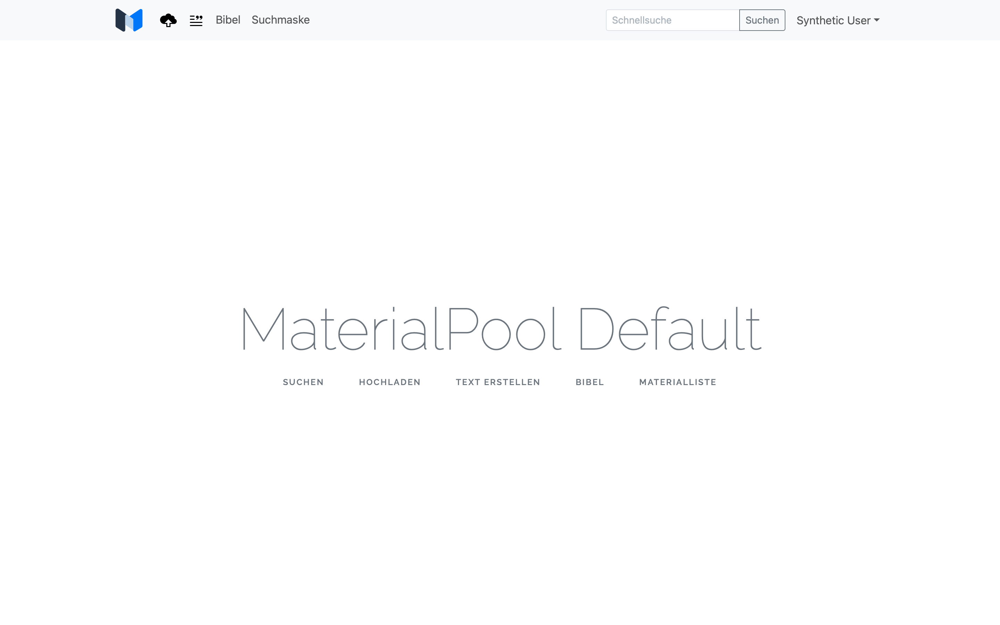
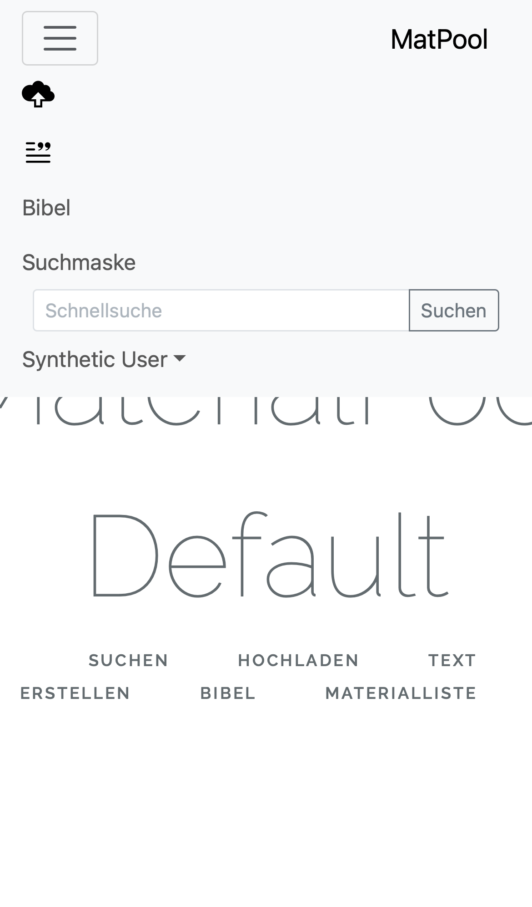
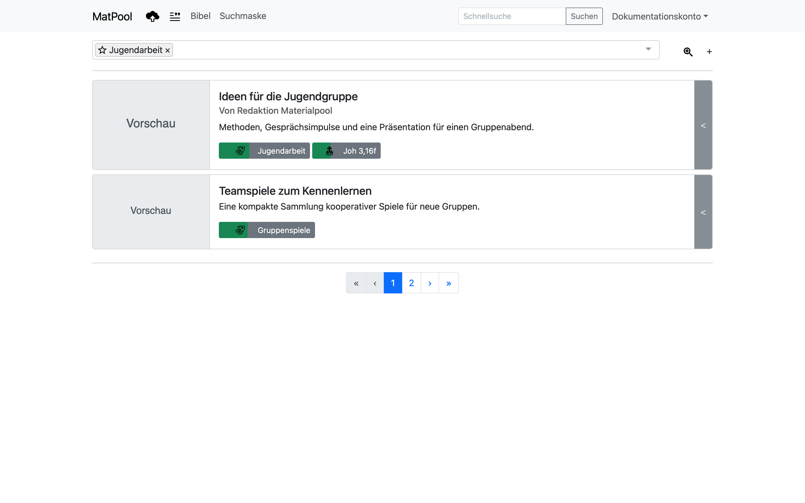
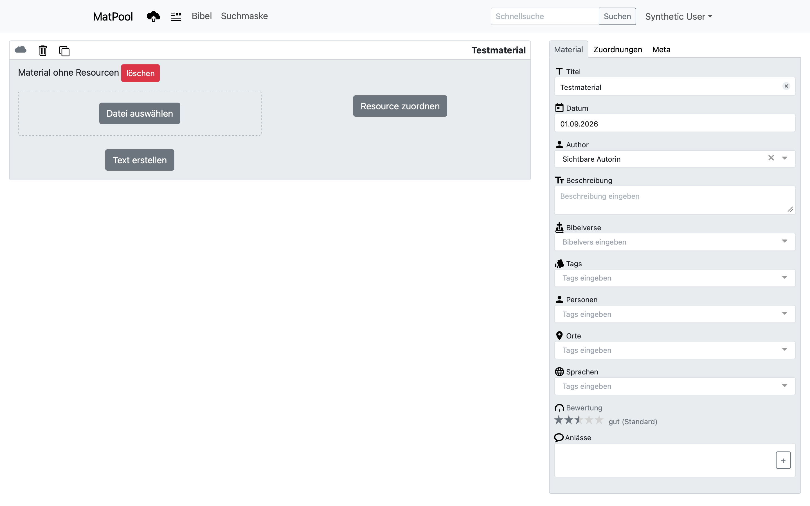
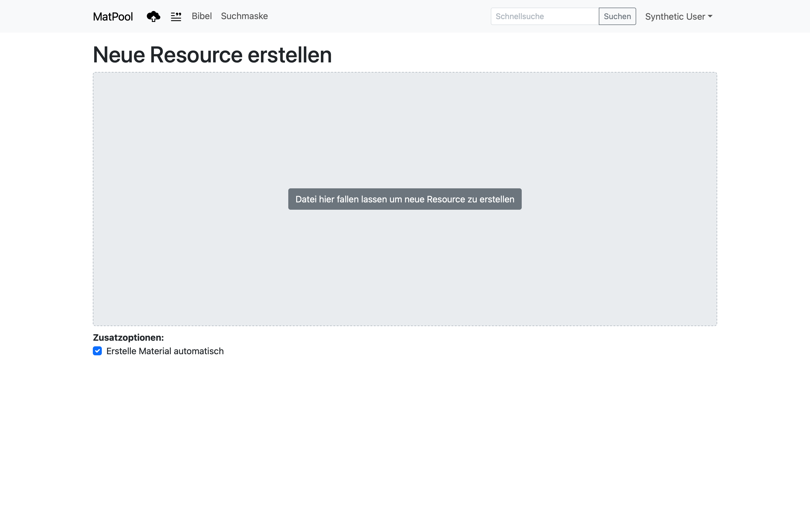
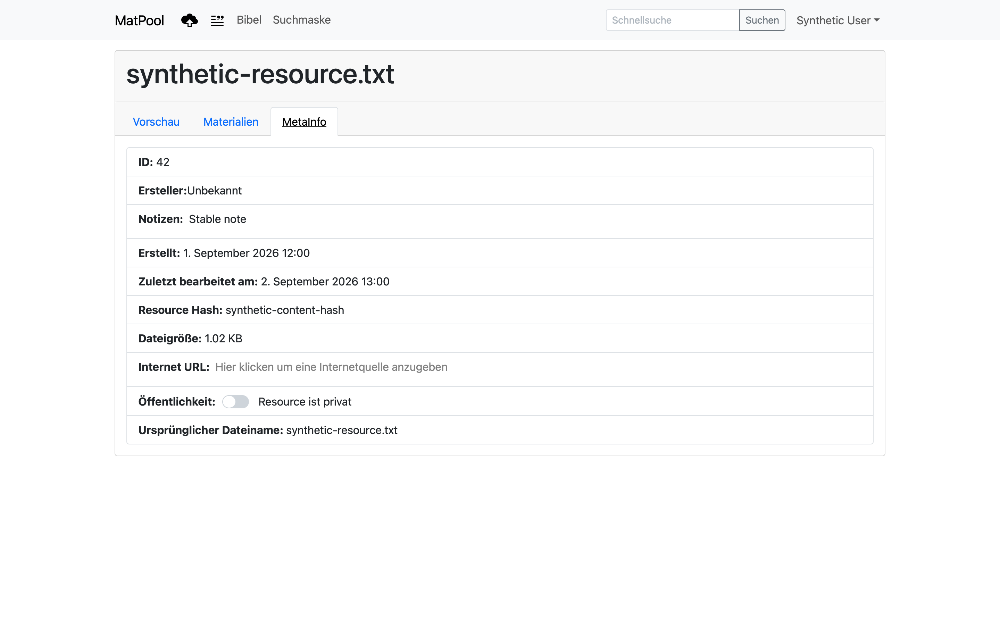
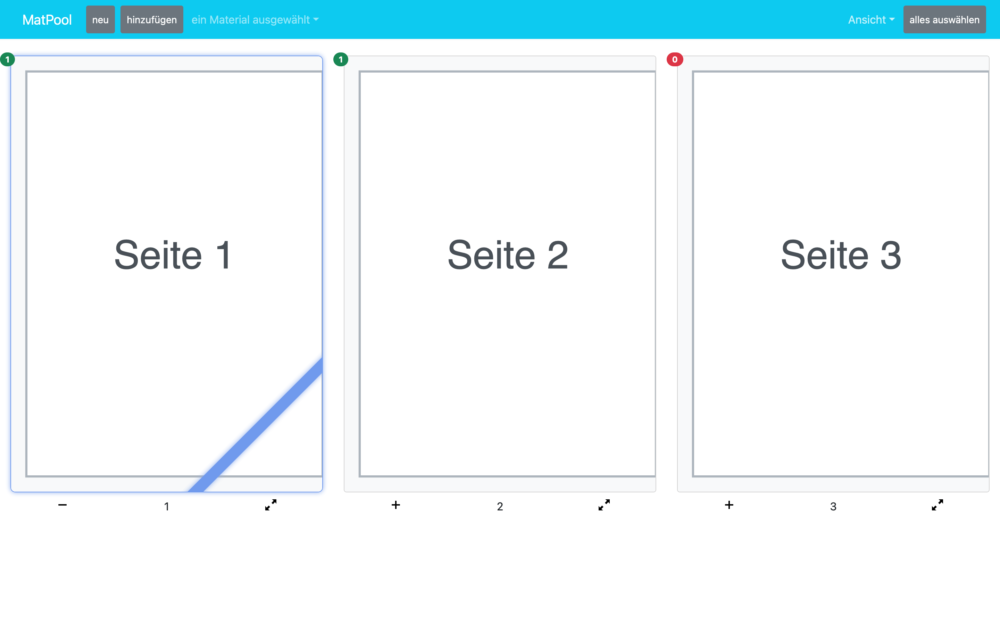
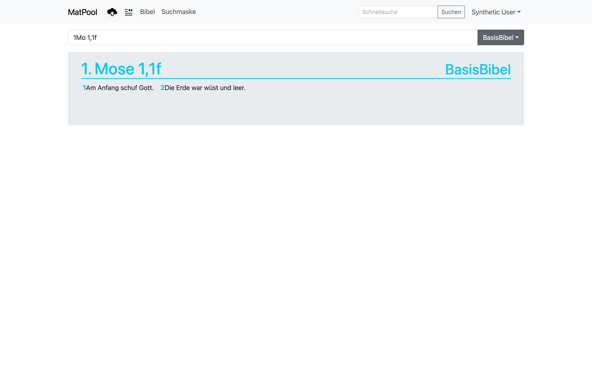
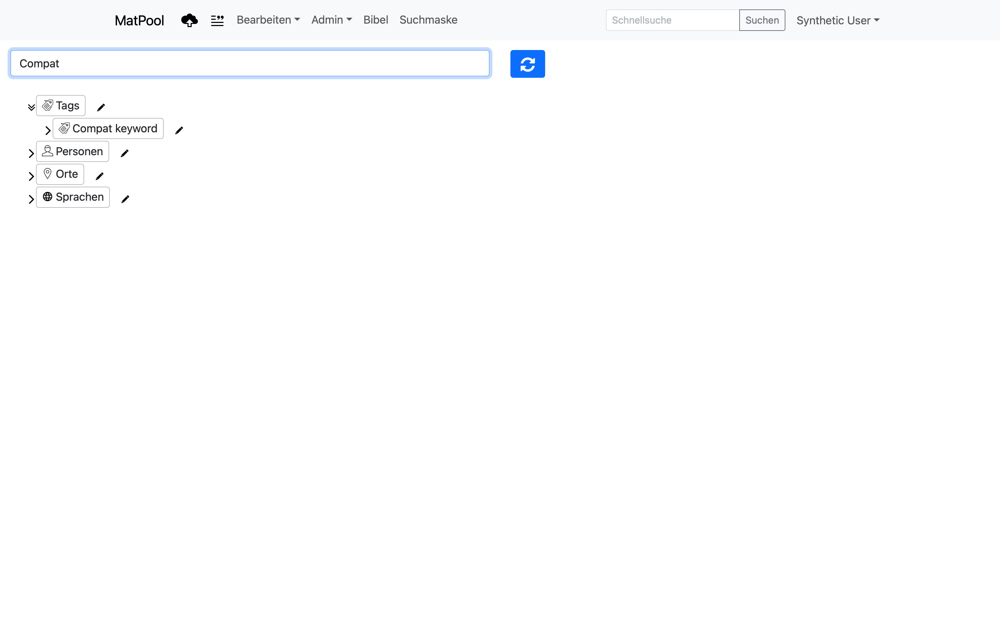
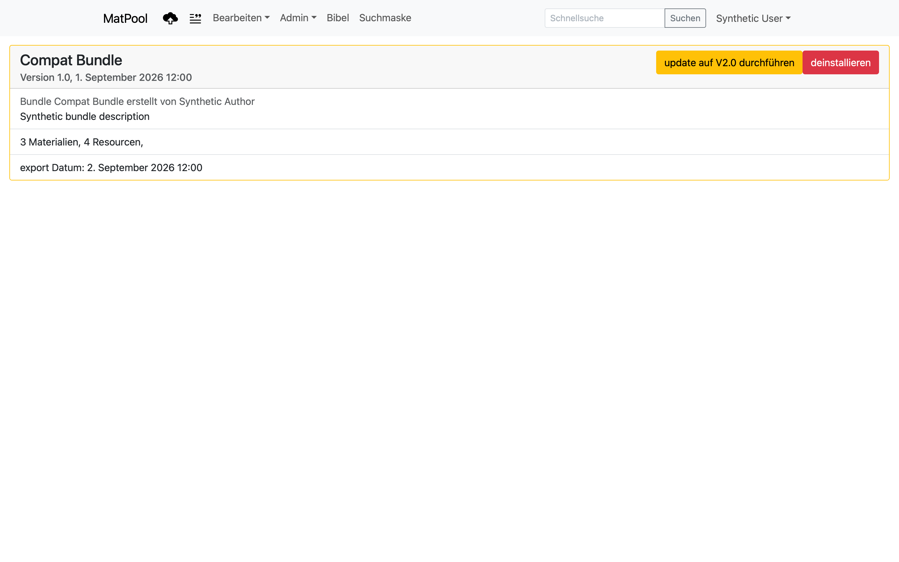

# Materialpool

Materialpool ist eine geschützte Laravel-Anwendung zur Verwaltung von Materialien, Dateien und anderen Ressourcen, Schlagwörtern, Bibelstellen, Nutzungen und importierten Bundles. Laravel stellt die Weboberfläche und die versionierten APIs bereit; die Hauptoberfläche läuft als Vue-3-Single-Page-App unter `/vue`.

Diese README richtet sich an drei Zielgruppen:

- **Administration** betreibt, installiert und aktualisiert die Produktionsinstanz.
- **Entwicklung** arbeitet lokal mit Laravel Sail, Vue 3, Pinia und Vite.
- **Anwendung** erklärt die Bedienung für angemeldete Benutzer und Administratoren.

> [!CAUTION]
> Befehle sind immer an einen Kontext gebunden. Produktions-, Entwicklungs- und Testbefehle dürfen nicht ungeprüft gegeneinander ausgetauscht werden. Insbesondere `migrate:fresh` und `db:seed` löschen beziehungsweise verändern Daten und sind ausschließlich für die verifizierte, entbehrliche Testdatenbank bestimmt.

## Inhaltsverzeichnis

- [1. Administration](#1-administration)
  - [1.1 Installation](#11-installation)
  - [1.2 Updates](#12-updates)
  - [1.3 Wartung](#13-wartung)
- [2. Entwicklung](#2-entwicklung)
- [3. Anwendung](#3-anwendung)

### Umgebungen und maßgebliche Dokumentation

| Kennzeichnung | Bedeutung |
| --- | --- |
| **Produktion** | Neue Installation: Proxmox mit Debian-LXC und getrenntem Qdrant-LXC. Bestehender Altbetrieb: Ubuntu-Server. Beide nutzen `/srv/materialpool`; PHP läuft als `www-data`. |
| **Entwicklung** | Lokale Docker-/Sail-Umgebung; nur lokale Entwicklungsdaten. |
| **Test** | Dedizierte, jederzeit entbehrliche MySQL-Datenbank `testing`; niemals Entwicklungs- oder Produktionsdaten. |

Diese README ist der zentrale Einstieg. Bei Abweichungen gelten die spezielleren Verträge unter [`docs/ai/`](docs/ai/) und insbesondere der [Produktions- und Deploymentvertrag](docs/ai/production-deployment-contract.md), die [Domänen-Invarianten](docs/ai/domain-invariants.md) und die [Quality Gates](docs/ai/quality-gates.md). Die geplante hybride Kontextsuche mit Qdrant, Ollama und KI-Funktionen ist im [Planungs- und Arbeitsvertrag zur Kontextsuche](docs/ai/context-search-ai-contract.md) festgehalten. `AGENTS.md` regelt zusätzlich die Arbeit von KI-Agenten. Die Pflege dieser README und ihrer Bilder ist in [`docs/ai/readme-maintenance.md`](docs/ai/readme-maintenance.md) festgelegt.

## 1. Administration

**Neuer Installationsweg:** Für neue Proxmox-Installationen gilt [Materialpool auf Proxmox VE](deployment/README.md) mit [Installation](deployment/docs/installation.md), [Update](deployment/docs/update.md) und [vollständiger Testanleitung](deployment/docs/testing.md). GitHub Actions testet und baut versionierte Releases; der unprivilegierte Debian-LXC betreibt Laravel mit Nginx, PHP-FPM 8.4 und MariaDB ohne Docker oder Node. Qdrant läuft in einem separaten LXC. Im Laravel-LXC startet `update` nach Veröffentlichung eines stabilen GitHub-Releases den geprüften Updateablauf. Ein bestehender Datenbestand benötigt einen gesondert verifizierten Restore; der Fresh-Installer verweigert die Übernahme.

Der Proxmox-Installer führt die Datenbankmigrationen beim ersten Release aus und fragt anschließend den ersten aktiven Global-Admin ab. Im LXC kann ein vorhandener Benutzer interaktiv mit `runuser -u www-data -- php /srv/materialpool/current/artisan users:manage update` bearbeitet werden; dabei lassen sich insbesondere E-Mail und Passwort ändern, ohne das Passwort als Befehlsargument oder im Terminalprotokoll auszugeben. Der produktive Datenbankzugang und `APP_KEY` liegen dauerhaft in `/srv/materialpool/shared/.env`, auf die jedes Release verweist. Weitere Einzelheiten und der Wiederanlauf bei abgebrochener Admin-Eingabe stehen in der [Installationsanleitung](deployment/docs/installation.md).

**Altbetrieb:** Die nachstehenden Abschnitte 1.1 bis 1.3 beschreiben weiterhin den vorhandenen Ubuntu-24.04-/MySQL-8-Server und `ops/production/`. Diese Befehle gelten nicht für den neuen Proxmox-LXC. Der neue Betrieb ist erst nach den in der Proxmox-Testanleitung beschriebenen externen Tests freigegeben.

Die Produktion läuft auf einem einzelnen Ubuntu-24.04-LTS-Server mit Nginx, PHP-FPM 8.4 und MySQL 8 hinter einem externen TLS-Reverse-Proxy. Supervisor betreibt den Default-Queue-Worker; Cron startet jede Minute Laravels Scheduler. Node.js wird auf dem Produktionsserver nicht benötigt.

### 1.1 Installation

#### Voraussetzungen

Vor Beginn müssen extern feststehen:

- Domain, SSH-Ziel und konkrete Proxy-IP beziehungsweise Proxy-CIDR;
- MySQL-Datenbank, dedizierter Datenbankbenutzer und starkes Passwort;
- SMTP-Konfiguration und reale Benachrichtigungsadresse;
- S3-kompatibler Endpoint, Region, Bucket und Zugangsdaten für Offsite-Backups;
- bestehender `APP_KEY` und bestehende Passport-Schlüssel bei einer Übernahme;
- ein sauberer, exakter Git-Commit, der installiert werden soll.

Das Provisioning installiert `qpdf` für den Download ausgewählter Seiten aus PDFs mit komprimierten Querverweisen. `production:preflight` prüft, ob das Programm verfügbar ist. Die Original-PDF wird dabei nicht verändert.

Die persistenten Pfade sind Teil des Datenvertrags:

```text
/srv/materialpool/releases/<UTC-Zeitstempel>-<Commit>/
/srv/materialpool/current -> releases/<aktives-release>/
/srv/materialpool/shared/.env
/srv/materialpool/shared/storage/
/srv/materialpool/shared/public-uploads/
/srv/materialpool/shared/backups/
/srv/materialpool/shared/incoming/
```

#### Server vorbereiten

Das Provisioning-Skript installiert die Laufzeitpakete und legt die Shared-Verzeichnisse an:

```sh
sudo ops/production/provision-ubuntu.sh
```

Danach müssen die vorhandenen Vorlagen kontrolliert installiert werden:

1. `ops/production/nginx.conf` mit realem `server_name` nach `/etc/nginx/sites-available/materialpool` übernehmen und aktivieren.
2. `ops/production/materialpool-worker.conf` nach `/etc/supervisor/conf.d/` übernehmen.
3. `ops/production/materialpool.cron` nach `/etc/cron.d/materialpool` übernehmen.
4. `ops/production/activate-release.sh` root-owned als `/usr/local/sbin/materialpool-activate-release` installieren.
5. `ops/production/materialpool.sudoers` mit `visudo -cf` prüfen und anschließend root-owned mit Modus `0440` installieren.
6. MySQL nur lokal lauschen lassen und den Materialpool-Benutzer auf genau eine Datenbank begrenzen.
7. Firewall beziehungsweise vorgelagerte Netzwerkregeln erst nach verifiziertem SSH-Zugang aktivieren.

Die Produktionsdatei `/srv/materialpool/shared/.env` enthält mindestens die im [Produktionsvertrag](docs/ai/production-deployment-contract.md#zwingende-produktionskonfiguration) genannten Werte. Secrets gehören weder in Git noch in Terminalprotokolle. `TRUSTED_PROXIES` darf niemals `*`, `**` oder `REMOTE_ADDR` enthalten. Die vorhandenen Passport-Schlüssel liegen unter dem Shared-Storage; der private Schlüssel muss Modus `0600` haben.

Vor dem ersten Release prüfen:

```sh
sudo nginx -t
sudo php-fpm8.4 -t
sudo supervisord -t
sudo systemctl status nginx php8.4-fpm mysql supervisor cron
```

#### Release bauen

Der Build akzeptiert ausschließlich einen exakten Commit und bricht bei nicht committeten Änderungen im Materialpool-Arbeitsbaum ab:

```sh
ops/production/build-release.sh <40-stellige-commit-id> /absoluter/ausgabeordner
```

Das Skript baut im festgelegten `sail-8.4/app`-Image, installiert Composer- und npm-Abhängigkeiten aus den Lockfiles, erzeugt die Vite-Assets und schreibt Archiv, Release-Manifest und SHA-256-Datei. Das Archiv enthält weder `.env` noch `node_modules` oder `vendor`.

#### Release hochladen und aktivieren

Der Upload aktiviert noch nichts:

```sh
ops/production/deploy-release.sh \
  /pfad/materialpool-<commit>.tar.gz \
  materialpool@server
```

Anschließend auf dem Server bewusst aktivieren:

```sh
sudo /usr/local/sbin/materialpool-activate-release \
  /srv/materialpool/shared/incoming/materialpool-<commit>.tar.gz
```

Die Aktivierung prüft Archiv und Manifest, verbindet die Shared-Pfade, setzt Rechte, installiert Composer-Pakete aus `composer.lock`, führt `production:preflight` und `optimize` aus, schaltet `current` atomar um und lädt PHP-FPM sowie den Default-Worker neu.

#### Erfolg prüfen

```sh
curl --fail --silent https://<domain>/up
sudo supervisorctl status 'materialpool-default:*'
sudo -u www-data php /srv/materialpool/current/artisan schedule:list
```

`/up` muss mit HTTP 200, `text/plain` und `OK` antworten. Zusätzlich manuell prüfen: Anmeldung, eine geschützte Seite, eine repräsentative Resource-Vorschau, Download, Schreibzugriff auf Shared-Storage und Verarbeitung eines ungefährlichen Testjobs.

> [!IMPORTANT]
> Eine wirklich frische Produktionsinstallation und die Übernahme eines Bestands sind nicht derselbe Ablauf. Datenbankschema, Passport-Clients und persistente Dateien müssen vor der Aktivierung bewusst geklärt sein. Der vorhandene Aktivierungsweg schützt Migrationen absichtlich durch Wartungsmodus und Restore-Nachweis; fehlende Erstinstallationswerte dürfen nicht improvisiert werden.

> [!CAUTION]
> In Produktion verboten sind `composer update`, `npm install`, `npm update`, `migrate:fresh`, `db:seed`, `key:generate` und `passport:install`. Sie verletzen den reproduzierbaren Release- beziehungsweise Datenvertrag.

### 1.2 Updates

#### Release ohne Datenbankmigration

**Vorher prüfen**

- Der gewünschte Commit ist vollständig geprüft und der Arbeitsbaum sauber.
- Das letzte unverschlüsselte lokale und externe Backup ist gesund und beide Ziele sind ausschließlich für berechtigte Administratoren erreichbar.
- Das unmittelbar vorherige Release bleibt für einen Rücksprung erhalten.

**Ausführen**

```sh
ops/production/build-release.sh <40-stellige-commit-id> /absoluter/ausgabeordner
ops/production/deploy-release.sh \
  /pfad/materialpool-<commit>.tar.gz \
  materialpool@server
```

Auf dem Server:

```sh
sudo /usr/local/sbin/materialpool-activate-release \
  /srv/materialpool/shared/incoming/materialpool-<commit>.tar.gz
```

**Erfolg erkennen**

- `/up` antwortet erfolgreich.
- Login, API, Storage und Queue funktionieren.
- Supervisor meldet den Default-Worker als `RUNNING`.
- Nginx- und Anwendungslogs zeigen keine neuen Fehler.

**Rollback**

Bei einem reinen Code-Release kann `current` kontrolliert auf das unmittelbar vorherige Release zurückgeschaltet werden. Danach `optimize`, `reload`, PHP-FPM und Supervisor neu starten und die Smoke-Tests wiederholen. Persistente Dateien werden dabei nicht gelöscht oder kopiert.

#### Release mit Datenbankmigration

Eine Migration ist erst erlaubt, wenn ein unverschlüsseltes Backup lokal und auf S3 erzeugt, heruntergeladen und auf einer isolierten MySQL-Instanz erfolgreich wiederhergestellt wurde. Der Nachweis umfasst Datenbank und repräsentative persistente Dateien.

**Vorher prüfen**

```sh
sudo -u www-data php /srv/materialpool/current/artisan migrate:status
sudo -u www-data php /srv/materialpool/current/artisan backup:monitor
```

Zusätzlich Release bauen und hochladen, Client-/Schema-Auswirkungen prüfen und den Restore-Nachweis protokollieren, ohne Secrets oder Nutzdaten festzuhalten.

**Wartungsfenster beginnen**

```sh
sudo -u www-data php /srv/materialpool/current/artisan down
sudo supervisorctl stop 'materialpool-default:*'
```

**Neues Release inklusive Migration aktivieren**

```sh
sudo MATERIALPOOL_RESTORE_PROOF_CONFIRMED=yes \
  /usr/local/sbin/materialpool-activate-release \
  /srv/materialpool/shared/incoming/materialpool-<commit>.tar.gz \
  --migrate
```

Das Aktivierungsskript führt `php artisan migrate --force` aus dem neuen, noch nicht aktiven Release aus. Die Schutzvariable bestätigt nur einen bereits erfolgten Restore-Test; sie erzeugt selbst keinen Nachweis.

**Nachkontrolle und Freigabe**

```sh
sudo -u www-data php /srv/materialpool/current/artisan migrate:status
sudo supervisorctl status 'materialpool-default:*'
curl --fail --silent https://<domain>/up
```

Erst nach erfolgreichen Login-, API-, Storage-, Queue- und fachlichen Smoke-Tests:

```sh
sudo -u www-data php /srv/materialpool/current/artisan up
```

Falls die freigegebene Migration `resources.filesize` ergänzt, wird der Altbestand danach separat eingeplant:

```sh
sudo -u www-data php /srv/materialpool/current/artisan resources:backfill-filesizes
```

Der Befehl ist idempotent, plant Batch-Jobs auf `database/default` ein und ist kein allgemeiner Bestandteil jedes Updates. Mit `--force` werden auch bereits gesetzte Werte neu berechnet.

**Rollback nach einer Migration**

Kein blindes `migrate:rollback` ausführen. Anwendung wieder sperren, Worker stoppen, Datenbank und persistente Dateien aus dem unmittelbar vorherigen geprüften Backup wiederherstellen, `current` auf das vorherige Release setzen, Caches optimieren, Dienste neu starten und Smoke-Tests ausführen.

Der erste Passport-13-Cutover folgt zusätzlich vollständig [`docs/ai/passport-13-client-migration.md`](docs/ai/passport-13-client-migration.md).

### 1.3 Wartung

In den Tabellen bedeutet **niedrig** „lesend oder regulärer Healthcheck“, **mittel** „ändert Laufzeitzustand“ und **hoch** „verändert Daten oder löscht abgeleitete beziehungsweise persistente Inhalte“.

#### Zustand und Diagnose

| Befehl | Umgebung/Benutzer | Wann verwenden? | Wirkung | Risiko |
| --- | --- | --- | --- | --- |
| `curl --fail --silent https://<domain>/up` | Extern | Monitoring und nach Deployments | Prüft, ob Laravel bootet; gibt nur `OK` aus. | niedrig |
| `php artisan about` | Produktion als `www-data` oder Sail | Versions- und Konfigurationsüberblick | Zeigt Laufzeitmetadaten; Ausgabe vor Weitergabe auf sensible Angaben prüfen. | niedrig |
| `php artisan migrate:status` | Produktion als `www-data` | Vor und nach einem Update | Zeigt ausgeführte und offene Migrationen. | niedrig |
| `php artisan schedule:list` | Produktion als `www-data` | Scheduler prüfen | Zeigt geplante Aufgaben und nächste Läufe. | niedrig |
| `php artisan production:preflight` | Produktion als `www-data` | Vor Aktivierung und bei Betriebsfehlern | Prüft Pflichtkonfiguration, Pfade, Programme, Schlüssel und MySQL, ohne Secrets auszugeben. | niedrig |
| `php artisan production:preflight --configuration-only` | Kontrollierte Prüfung | Konfiguration ohne Runtimezugriffe untersuchen | Überspringt Dateisystem-, Programm- und Datenbankchecks; ersetzt keinen echten Preflight. | niedrig |

In Produktion steht `php artisan` in den Beispielen für:

```sh
sudo -u www-data php /srv/materialpool/current/artisan <befehl>
```

#### Wartungsmodus und Caches

| Befehl | Umgebung/Benutzer | Wann verwenden? | Wirkung | Risiko |
| --- | --- | --- | --- | --- |
| `php artisan down` | Produktion, `www-data` | Vor einer freigegebenen Migration oder Restore-Aktion | Sperrt reguläre Zugriffe. | mittel |
| `php artisan up` | Produktion, `www-data` | Erst nach erfolgreichen Smoke-Tests | Hebt den Wartungsmodus auf. | mittel |
| `php artisan optimize` | Produktion, `www-data` | Aktivierung oder kontrollierte Cache-Neuerzeugung | Baut Laravel-Laufzeitcaches neu auf. | mittel |
| `php artisan optimize:clear` | Produktion, `www-data` | Diagnose eines nachgewiesenen Cacheproblems | Entfernt abgeleitete Laravel-Caches; kann Leistung vorübergehend verschlechtern. | mittel |
| `php artisan reload` | Produktion, `www-data` | Nach Releasewechseln | Signalisiert lang laufenden Laravel-Prozessen einen Reload. | mittel |

#### Resource-Vorschauen

Geänderte oder neu angelegte Resources planen ihre Vorschauen nach dem Datenbank-Commit automatisch auf der nachrangigen Queue `resource-previews-low` ein. Für Resources, Dokumentseiten und Materialkarten wird dabei ausschließlich die kleine Variante (maximal 640 × 640 Pixel, JPEG-Qualität 80) vorbereitet. Die große Variante (maximal 1536 × 1536 Pixel, ebenfalls JPEG-Qualität 80) entsteht erst beim Öffnen einer Detail- oder Zoomansicht und wird anschließend regulär gecacht. Ändert sich die Resource, aus der ein Material seine Vorschau bezieht, wird auch dessen kleine Materialvorschau auf dieser Queue neu erzeugt. Der Worker verarbeitet weiterhin `default` zuerst; Vorschauen dürfen deshalb bei regulärer Last warten.

Geschützte Vorschauantworten werden vom Browser sieben Tage ausschließlich privat (`private, max-age=604800`) gespeichert. Ein ETag verhindert nach Ablauf unnötige Bildübertragungen. Bereits vorhandene große Cache-Varianten bleiben erhalten; der Backfill plant nur fehlende kleine Varianten.

| Befehl | Umgebung/Benutzer | Wann verwenden? | Wirkung | Risiko |
| --- | --- | --- | --- | --- |
| `php artisan resources:queue-previews [--chunk=100]` | Produktion, `www-data` | Einmalig nach Einführung der Funktion oder gezielt zum Nachziehen bestehender Resources | Plant fehlende kleine Vorschauen in Batches mit 1–1000 Resources auf `resource-previews-low` ein; bei mehrseitigen Dokumenten eine Variante je Seite sowie die zugehörige kleine Materialvorschau. Der Befehl ändert keine Resource-Daten. | mittel; kann Queue und Dateiverarbeitung deutlich auslasten |
| `php artisan resources:clear-preview-cache --force` | Produktion, `www-data` | Nur gezielt bei einem bestätigten Vorschau-Cacheproblem oder vor einem bewusst geplanten vollständigen Neuaufbau | Löscht ausschließlich abgeleitete Resource-Vorschaubilder und temporäre Dokument-PDFs. Anschließend müssen Vorschauen erneut erzeugt werden. Ohne `--force` führt der Befehl keine Löschung aus. | **hoch; löscht abgeleitete Inhalte und kann Folgelast erzeugen** |

Vor einem vollständigen Neuaufbau den Workerzustand prüfen und ausreichend freien Speicher sowie Queue-Kapazität sicherstellen. Nach `resources:clear-preview-cache --force` bei Bedarf `resources:queue-previews --chunk=100` ausführen und `supervisorctl status 'materialpool-default:*'` sowie `php artisan queue:failed` kontrollieren.

#### Queue und Scheduler

| Befehl | Umgebung/Benutzer | Wann verwenden? | Wirkung | Risiko |
| --- | --- | --- | --- | --- |
| `supervisorctl reread && supervisorctl update` | Produktion, `root` | Nach Änderung von `materialpool-worker.conf` | Liest die Supervisor-Konfiguration neu ein und übernimmt Programmänderungen; kann betroffene Worker starten oder stoppen. | mittel |
| `supervisorctl status 'materialpool-default:*'` | Produktion, `root` | Regelmäßige Kontrolle | Zeigt Zustand des Default-Workers. | niedrig |
| `supervisorctl restart 'materialpool-default:*'` | Produktion, `root` | Nach Deployments oder hängendem Worker | Startet den überwachten Default-Worker neu. | mittel |
| `php artisan queue:restart` | Produktion, `www-data` | Kontrolliertes Auslaufen bestehender Worker | Fordert Worker zum Neustart nach ihrem aktuellen Job auf. | mittel |
| `php artisan schedule:run` | Produktion, `www-data` | Scheduler gezielt diagnostizieren | Führt alle aktuell fälligen Tasks einmal aus; kann Backup/Cleanup starten. | mittel |
| `php artisan queue:work database --queue=default,resource-previews-low --sleep=3 --tries=50 --timeout=120 --max-time=3600` | Normalerweise nur Supervisor | Workerdefinition prüfen oder isoliert diagnostizieren | Verarbeitet normale Jobs vor nachrangigen Resource-Vorschauen. Nicht parallel zum regulären Worker starten. | hoch |

Dynamische `bundle_<id>_queue`-Queues werden nicht vom Default-Worker konsumiert. Sie werden im normalen Ablauf über die Bundle-API schrittweise verarbeitet.

#### Backups

| Befehl | Umgebung/Benutzer | Wann verwenden? | Wirkung | Risiko |
| --- | --- | --- | --- | --- |
| `php artisan backup:list` | Produktion, `www-data` | Bestand und Alter prüfen | Listet lokale und externe Backups. | niedrig |
| `php artisan backup:monitor` | Produktion, `www-data` | Healthcheck und nach Backupfehlern | Prüft Erreichbarkeit, Alter und Speichergrenzen und verschickt konfigurierte Meldungen. | niedrig |
| `php artisan backup:run` | Produktion, `www-data` | Vor Migrationen oder manuell angefordert | Erstellt ein unverschlüsseltes Datenbank-/Dateibackup auf `backup` und `backup_s3`. | mittel |
| `php artisan backup:clean` | Produktion, `www-data` | Nur nach Prüfung der Aufbewahrungsregeln | Löscht alte Backups gemäß Konfiguration. | hoch |

Ein erfolgreich erzeugtes oder hochgeladenes Archiv ist noch kein verifiziertes Backup. Erst Download und Restore auf einer isolierten MySQL-Instanz belegen die Wiederherstellbarkeit. Die Archive enthalten lesbare Daten und dürfen daher ausschließlich in privaten, restriktiv berechtigten Ablagen liegen.

#### Fachbefehle

| Befehl | Umgebung/Benutzer | Wann verwenden? | Wirkung | Risiko |
| --- | --- | --- | --- | --- |
| `php artisan resources:backfill-filesizes [--chunk=100] [--force]` | Nach freigegebener Migration | Fehlende persistierte Dateigrößen ergänzen | Plant Batches mit 1–1000 Resources auf `database/default` ein. | mittel; `--force` berechnet alle geeigneten Werte neu |
| `php artisan resources:check:duplicates` | Nur nach Backup und fachlicher Prüfung | Nachgewiesene Hash-Dubletten bereinigen | Führt Resource-Dubletten und Materialzuordnungen zusammen. | **hoch; Datenmutation** |
| `php artisan import:zefaniabible <absoluter-xml-pfad>` | Nur kontrollierte Administration | Eine geprüfte Zefania-Bibel importieren | Importiert Bibelinhalt aus XML in die Datenbank. | **hoch; Datenmutation** |

#### Bundle-Störung beheben

Vor einer Bundle-UUID- oder Foreign-ID-Constraint-Migration ist ausschließlich folgender read-only Preflight zulässig. Er gibt nur Konfliktzählwerte aus und verändert keine Daten:

```sh
sudo -u www-data php /srv/materialpool/current/artisan bundles:preflight-identifiers
```

Bei einem Fehler keine Migration und keine Datenkorrektur starten; zuerst die Konfliktform fachlich klären.

<details>
<summary>Manuelle Wiederaufnahme eines Bundle-Imports</summary>

Dieser Notfallweg verarbeitet ausschließlich einen bereits gestarteten, aktiven Lauf. Er erzeugt keinen Import und kann daher parallel zum Browser genutzt werden. Vorher Bundle-ID, aktiven Lauf und Fehlerursache prüfen. Nie eine Beispiel-ID ungeprüft übernehmen.

Lauf und Queue zunächst nur lesend prüfen:

```sh
sudo -u www-data php /srv/materialpool/current/artisan bundles:work <bundle-id> --dry-run
```

Anschließend denselben Laravel-Database-Worker starten:

```sh
sudo -u www-data php /srv/materialpool/current/artisan bundles:work <bundle-id>
```

Nachkontrolle: Bundle-Fortschritt im UI, aktiver Run und Anwendungslog. Der Browser darf geschlossen werden; die Queue und ein Terminal-Worker laufen unabhängig weiter. Browser und Terminal dürfen denselben Lauf gleichzeitig verarbeiten, weil sie verschiedene Queue-Nachrichten atomar reservieren; die Entity-Locks verhindern parallele Bearbeitung desselben Datensatzes.

</details>

#### System- und Logkontrolle

```sh
sudo systemctl status nginx php8.4-fpm mysql supervisor cron
sudo journalctl -u nginx -u php8.4-fpm -u mysql --since today
sudo supervisorctl status 'materialpool-default:*'
sudo tail -n 200 /var/log/supervisor/materialpool-worker.log
sudo tail -n 200 /srv/materialpool/shared/storage/logs/laravel.log
df -h /srv/materialpool
sudo nginx -t
sudo php-fpm8.4 -t
```

Logs können Nutzdaten, URLs oder interne Pfade enthalten. Vor Weitergabe immer prüfen und sensible Werte entfernen. Rechte nicht pauschal mit `chmod -R 777` reparieren; die vorgesehenen Eigentümer sind `materialpool:www-data`, und nur Shared-Storage, `public/uploads` sowie `bootstrap/cache` sind zur Laufzeit beschreibbar.

## 2. Entwicklung

### Lokale Voraussetzungen und Start

- Docker mit Compose-Unterstützung;
- Composer zum initialen Aufbau von `vendor/` oder ein kontrollierter Composer-Container;
- Node.js gemäß [`.node-version`](.node-version), aktuell 24.21.0;
- npm gemäß `package.json`, aktuell 11.19.0.

Abhängigkeiten werden aus `composer.lock` und `package-lock.json` installiert. Keine Updates als Nebeneffekt eines lokalen Starts durchführen.

```sh
composer install
test -f .env || cp .env.example .env
npm ci --ignore-scripts
./vendor/bin/sail up -d
```

Nur bei einer frisch angelegten `.env` ohne `APP_KEY` einmal `./vendor/bin/sail artisan key:generate` ausführen. Bei bestehenden verschlüsselten Daten den vorhandenen Schlüssel übernehmen und nicht ersetzen. `composer install` setzt PHP 8.4 mit den benötigten Erweiterungen voraus; ist das lokal nicht verfügbar, Composer in einem passenden PHP-8.4-Container ausführen. Das ältere Host-PHP ist keine gültige Referenz für das Projekt.

Die lokale `.env` wird nicht versioniert. Docker Compose liest aus ihr die Werte für MySQL und Qdrant; Laravel verwendet dieselbe Datei über das eingebundene Projektverzeichnis. `DB_HOST=mysql`, `DB_DATABASE`, `DB_USERNAME` und `DB_PASSWORD` müssen zur lokalen MySQL-Instanz passen. Eine zusätzliche `.env.local` ist dafür nicht erforderlich. Entwicklungsdaten und Testdaten bleiben getrennt. Anschließend das Entwicklungssystem starten:

```sh
./vendor/bin/sail artisan dev
```

Laravel 13 startet damit standardmäßig Server, Queue-Listener, Logansicht und `npm run dev` für Vite. `npm run dev` generiert zuerst die JavaScript-Übersetzungen und startet danach Vite mit HMR.

### Kontextsuche

Die Kontextsuche wird gemäß dem [Planungs- und Arbeitsvertrag](docs/ai/context-search-ai-contract.md) auf Qdrant aufgebaut. Der lokale Compose-Stack verwendet die fest gepinnte Qdrant-Version 1.19.1. Die REST-Schnittstelle wird nur an `127.0.0.1` veröffentlicht und intern mit `QDRANT_API_KEY` geschützt. Der mitgelieferte Schlüssel ist ausschließlich für lokale Entwicklung bestimmt; produktive Schlüssel werden über die Server-Secret-Konfiguration gesetzt und Qdrant wird dort nur über ein abgesichertes privates Netz beziehungsweise TLS erreicht.

Bei einer bereits vorhandenen lokalen `.env` müssen die `QDRANT_*`, `CONTEXT_SEARCH_*`- und `FORWARD_QDRANT_PORT`-Werte einmal aus `.env.example` übernommen werden. Danach Qdrant und die Anwendung starten und den Healthcheck prüfen:

```sh
docker compose up -d qdrant laravel.test
docker compose ps qdrant
```

Eine leere, versionierte Collection samt Payload-Indizes wird bewusst manuell provisioniert. `profile` ist ein unveränderlicher, kleingeschriebener Profil-Hash; `generation` ist ein eindeutiger technischer Generationsbezeichner. `--activate` schaltet den stabilen Alias atomar auf die neue Collection um:

```sh
./vendor/bin/sail artisan context-search:qdrant:provision \
  a1b2c3d4 20260922t120000z --activate
```

Der Befehl speichert noch keine Ressourcen oder Vektoren. Vor dem Aktivieren einer später befüllten Generation sind die im Vertrag vorgesehenen Qualitäts- und Kapazitätsprüfungen Pflicht. Bis zur Suchintegration bleibt `CONTEXT_SEARCH_ENABLED=false`; die bestehende direkte Suche arbeitet unverändert weiter.

#### Ollama-Modellprofil und Pool

Der Kontextsuche-Pool verwendet ausschließlich `CONTEXT_SEARCH_EMBEDDING_MODEL`; ein generatives Modell kann daher nicht versehentlich Suchvektoren erzeugen. Jeder Poolserver muss exakt dieses Modell mit demselben Modell-Digest bereitstellen. Die Serverliste folgt dem Format `name=url|max_parallel_jobs`, mehrere Server werden durch Komma getrennt. Zugangsdaten stehen getrennt in `CONTEXT_SEARCH_OLLAMA_API_KEYS` als `name=secret`-Einträge und gehören ausschließlich in Server-Secrets, nie ins Repository.

Vor einer Indexgeneration ist auf jedem Ollama-Server der Modell-Digest über `GET /api/tags` zu ermitteln und als `CONTEXT_SEARCH_EMBEDDING_DIGEST` zu setzen. Danach prüft der folgende lesende Selbsttest Modellname, Digest und die tatsächlich gelieferte Vektordimension auf allen konfigurierten Servern:

```sh
./vendor/bin/sail artisan context-search:ollama:verify
```

### Manuelle Indexierung von PDF- und Textressourcen (Stufe 1)

Die erste Indexierung ist technisch nur per bewusstem Kommando vorgesehen; Änderungen an Materialien oder Ressourcen lösen keinen Indexlauf aus. **Der bisherige manuelle Worker darf derzeit nicht gestartet werden:** Sein 180-Sekunden-Timeout überschreitet die 150-Sekunden-Reservierungsfrist der Datenbank-Queue. Neue manuelle Index- und OCR-Kalibrierungsläufe dürfen bis zum einmaligen Cutover ebenfalls nicht gestartet werden. Der [Queue-Änderungsvertrag](docs/ai/context-search-queue-change-contract.md) beschreibt die getrennte Connection, begrenzte Seitenjobs und die Abnahme vor Wiederfreigabe. Der frühere Workeraufruf wird deshalb hier nicht mehr als ausführbare Anleitung angeboten.

Die vorbereitete Connection `context_search` verwendet eigene Queue-Namen und `CONTEXT_SEARCH_QUEUE_RETRY_AFTER` (Beispielwert 600 Sekunden); `QUEUE_RETRY_AFTER=150` für normale Jobs bleibt unverändert. Neue Index- und OCR-Kalibrierungsläufe werden jetzt **vor dem Anlegen eines Laufdatensatzes technisch abgewiesen**. Der folgende Befehl prüft die aufgelöste Konfiguration und inventarisiert nur die Anzahl wartender, reservierter und fehlgeschlagener Altaufträge; er startet oder löscht nichts:

Für Schritt 3 ist eine seitenweise Pipeline in Arbeit: Extrahierter Text wird vorübergehend privat unter `storage/app/context-search-ocr-artifacts` abgelegt. Die Dateien sind abgeleitet und vom Backup ausgenommen; fehlen sie nach Bereinigung oder Restore, wird nur die betroffene Seite aus der Originalressource neu extrahiert. Bis die vollständigen OCR-/Last-/Restore-Gates bestanden sind, bleibt die neue Queue weiterhin gesperrt und die Worker-Vorlage deaktiviert.

Zwei additive Folgemigrationen gleichen frühe Dev-Datenbanken an, in denen die Seitenpipeline-Migration bereits als ausgeführt vermerkt war, aber noch `index_revision` beziehungsweise `skip_reasons` fehlten. Frische Installationen besitzen diese Spalten schon; die Folgemigrationen prüfen ihren Bestand und verändern dort nichts. Vor einem freigegebenen Upgrade wie üblich `migrate:status`, Backup/Restore-Nachweis und den tatsächlichen Schemazustand prüfen. Ein lokaler Einzelressourcen-Probelauf ist kein Ersatz für die ausstehende Produktionsabnahme.

```sh
./vendor/bin/sail artisan context-search:queue:check
```

Die Option `--configuration-only` verzichtet auf die lesende Datenbankinventarisierung. Auch eine erfolgreiche Prüfung ist **keine Startfreigabe** für einen Worker. Der Cutover erfolgt erst nach Schritt 3 des Queue-Vertrags.

Die zukünftigen, derzeit deaktivierten Worker-Definitionen und der störungssichere Cutover sind in der [Betriebsanleitung zur Kontextsuche-Queue](docs/ai/context-search-queue-operations.md) beschrieben. Die Vorlage unter `ops/production/materialpool-context-search-workers.conf.example` darf vor der Abnahme von Schritt 3 nicht installiert oder gestartet werden.

Der Laufzustand wird in MySQL gespeichert und ein fehlgeschlagener Lauf kann anhand seiner UUID fortgesetzt werden. Jeder Qdrant-Punkt enthält die Ressourcen-ID, die Dokumentrevision, die PDF-Seite beziehungsweise Textseite sowie Zeichenpositionen; die Originaldatei bleibt außerhalb von Qdrant. Für PDF-Seiten mit zu wenig eingebettetem Text wird Tesseract mit den Sprachpaketen `deu` und `eng` verwendet. Die OCR-Rasterung zielt auf 300 DPI und reduziert die Auflösung bei großen Seiten so, dass das konfigurierte Budget von standardmäßig 12 Millionen Pixeln eingehalten wird. Die tatsächlich verwendete DPI-Zahl steht in den OCR-Metriken; Text und TSV-Konfidenzen entstehen in einem Tesseract-Lauf. Das Sail-Image installiert diese Werkzeuge beim Neuaufbau automatisch; auf Produktionsservern müssen `pdftotext`, `pdfinfo`, `pdftoppm`, `tesseract`, `tesseract-ocr-deu` und `tesseract-ocr-eng` vor dem Start eines Indexworkers verfügbar sein.

Ein abweichender Digest, Modellname oder eine andere Dimension ist ein Konfigurationsfehler: Der Pool stoppt dann, statt Vektoren verschiedener Modelle zu mischen. Bei Netzwerkfehlern, Timeouts, Überlastung oder 5xx-Antworten verteilt er eine Anfrage deterministisch auf den nächsten gesunden Server. Nach den konfigurierbaren Fehlschlägen öffnet der serverbezogene Circuit Breaker zeitweise; jede Serverdefinition besitzt zudem ihr eigenes gemeinsames Parallelitätslimit. Erst der erfolgreiche Selbsttest berechtigt zum Provisionieren und Befüllen einer Indexgeneration.

Die praktische Reihenfolge für OCR-Test, Bewertung und Parameterübernahme steht nach dem Export-/Importablauf unter [OCR testen und Schwellenwerte einstellen](#ocr-testen-und-schwellenwerte-einstellen).

### Evaluationsdatensätze aus Produktion

Kalibrierung, Modellvergleich und Abnahme erfolgen ausschließlich in einer isolierten Evaluationsumgebung. Produktion darf hierfür nur einen eingefrorenen Datensatz erzeugen und als Archiv exportieren; die Befehle rufen weder Ollama noch Qdrant auf. Sie berücksichtigen ausschließlich PDF- und Textressourcen. Die Produktionsdatenbank wird nicht kopiert.

Die Ablage `CONTEXT_SEARCH_EVALUATION_PATH` muss auf beiden Systemen ein privater, nicht durch Nginx erreichbarer Pfad mit restriktiven Rechten sein. Standardmäßig liegt sie unter `storage/app/context-search-evaluation`. Die Übertragung des Archivs ist nach der getroffenen Entscheidung unverschlüsselt zulässig; Archiv- und Manifest-Prüfsumme sind vor dem Import zwingend zu prüfen. Private Inhalte verlangen die sichtbare Freigabe `--include-private` und eine Begründung. Keine Titel oder Inhalte in Shell-Historien, Tickets oder Logs übernehmen.

```sh
# Produktion: ausschließlich inhaltsfreie Größenordnung vor der Auswahl prüfen.
php artisan context-search:dataset:inventory --json
# Produktion: Auswahl anhand bekannter IDs einfrieren.
php artisan context-search:dataset:freeze calibration \
  --materials=101,102,103 --include-private --reason='Kuratiertes Kalibrierungsset'
```

Der `acceptance`-Datensatz ist ein unveränderlicher Holdout: Wird er zur Kalibrierung verwendet, muss ein neuer Abnahmedatensatz erzeugt werden.

Global Admins können die Auswahl außerdem über **KI-Datensätze** im persönlichen Benutzermenü kuratieren. Eine ganze Datensatzkarte ist anklickbar und per Tastatur bedienbar; Icons und Beschriftungen haben einheitliche Abstände. Eine seitenbezogene Sammelaktion fügt alle vollständig auswählbaren Material-/Ressourcenblöcke der sichtbaren Seite hinzu oder entfernt – als jeweils einzige angezeigte Aktion – deren lokale Auswahl. Sie verändert keine Auswahl anderer Seiten und überspringt gesperrte Blöcke. Der Server ergänzt und prüft den vollständigen zusammenhängenden Block aus Materialien und PDF-/Textressourcen verbindlich. OCR darf dieselben vollständigen Blöcke wie Kalibrierung oder Abnahme enthalten; Last und Kapazität dürfen als unabhängige Betriebsprüfungen mit allen anderen Zwecken einschließlich einander überlappen. Kalibrierung und Abnahme bleiben strikt voneinander getrennt; Last-/Kapazitätsmessungen dürfen nicht zur Anpassung semantischer Relevanz oder Schwellenwerte verwendet werden. Der linke Vorschaubereich bleibt beim Scrollen sichtbar, die Aktionen liegen auf dem Bild, und beim Wechsel des Materials wird die vorherige Grafik bis zum Laden der neuen Vorschau durch einen Ladeindikator ersetzt; falls keine Vorschau verfügbar ist, erscheint ein entsprechender Hinweis. Modalvorschauen erlauben das Durchblättern aller bekannten PDF-Seiten; Material- und Ressourcendetails öffnen jeweils in einem neuen Tab. Zugehörigkeiten und Konflikte sind sichtbar. Aus dem aktiven, noch veränderbaren Entwurf können Blöcke nach Bestätigung wieder als ganzer Block entfernt werden. Die Filter einschließlich Bundle beziehungsweise eigene Materialien ohne Bundle sowie die Seitennummer sind in der Adresse enthalten; die Seitennavigation erlaubt Einzelschritte und Zehnersprünge. Ein Server prüft vor dem Speichern die Versionsnummer und die Zweckregeln für Überschneidungen; die Vorschau im Browser ist keine Sicherheitsentscheidung. Die Zweck-Icons zeigen einen zugänglichen Fortschrittsdialog mit Ist-/Sollmengen und Teilquoten. Private Quellen benötigen eine ausdrückliche Auswahl samt Begründung. Erst ein vollständiger Entwurf kann eingefroren und danach exportiert werden.

Ein bereits im Browser vollständig kuratierter Datensatz mit Status `ready` kann bei einem Browser-Timeout über die CLI eingefroren werden. Nach einem Timeout zuerst die Browseransicht neu laden: Der Vorgang könnte trotz unterbrochener Antwort abgeschlossen worden sein. Ohne UUID zeigt der Befehl alle offenen und geschlossenen Datensätze mit Ist-/Sollmengen und Bewertung von Status und Quoten. Im interaktiven Terminal stehen nur formal einfrierbare Datensätze zur Auswahl; die Verfügbarkeit der Quelldateien wird erst beim Einfrieren geprüft. In Skripten oder ohne interaktives Terminal die UUID ausdrücklich angeben. Sie steht nach Auswahl der Datensatzkarte im URL-Parameter `dataset`. `DATENSATZ_UUID` durch die tatsächliche UUID ersetzen:

```sh
# Lokale Sail-Umgebung
./vendor/bin/sail artisan context-search:dataset:freeze-curated
./vendor/bin/sail artisan context-search:dataset:freeze-curated DATENSATZ_UUID
# Produktionsserver ohne Sail, im Anwendungsverzeichnis
php artisan context-search:dataset:freeze-curated
php artisan context-search:dataset:freeze-curated DATENSATZ_UUID
```

Der Befehl verwendet genau die gespeicherten Mitgliedschaften und friert denselben Datensatz mit derselben UUID ein. Er läuft synchron im CLI-Prozess und zeigt während der Verarbeitung der Materialien und Ressourcen einen Fortschrittsbalken; bei vielen PDF-Dateien kann er dennoch längere Zeit benötigen. Er ändert einen `ready`-Datensatz dauerhaft zu `frozen`; ein bereits eingefrorener oder unvollständiger Datensatz wird abgewiesen. Danach UUID und Mengen in der Ausgabe sowie den Status nach Neuladen der Browseransicht kontrollieren. Ein Archiv entsteht erst durch den separaten `context-search:dataset:export`-Befehl. `reconcile-memberships --apply` dient ausschließlich dem Nachtragen fehlender Mitgliedschaften in bereits eingefrorenen Alt-Datensätzen und friert keine Browser-Vorauswahl ein.

#### Nach dem Freeze: Archiv exportieren und prüfen

Die folgenden Befehle im Anwendungsverzeichnis auf dem System ausführen, auf dem der Datensatz eingefroren wurde. `UUID_HIER_EINTRAGEN` einmal durch die UUID aus der Freeze-Ausgabe ersetzen. **Entweder** den Sail-Block für die lokale Umgebung **oder** den `php artisan`-Block auf einem Server ohne Sail verwenden. Der Export schreibt das Archiv in die private Evaluationsablage und setzt den Datensatzstatus auf `exported`; bei großen Datensätzen benötigt er Zeit und ausreichend freien Speicherplatz. Er erzeugt keine KI-Auswertung. Export, Prüfung und Import zeigen für ihre Verarbeitungsschritte Fortschrittsbalken; beim Schreiben des ZIP-Archivs kann ein einzelner Schritt länger dauern.

Wer die UUID nicht zur Hand hat, kann den Export stattdessen interaktiv ohne Argument starten. Es werden eingefrorene, noch nicht exportierte Datensätze mit UUID, Zweck und Mengen angezeigt. Ohne interaktives Terminal muss die UUID angegeben werden. Nach der Auswahl die ausgegebene UUID für `verify` verwenden:

```sh
# Lokale Sail-Umgebung
./vendor/bin/sail artisan context-search:dataset:export
```

```sh
# Server ohne Sail
php artisan context-search:dataset:export
```

```sh
# Lokale Sail-Umgebung
DATASET_UUID='UUID_HIER_EINTRAGEN'
./vendor/bin/sail artisan context-search:dataset:export "$DATASET_UUID"
ARCHIVE_NAME='DATEINAME_AUS_EXPORTAUSGABE.zip'
./vendor/bin/sail artisan context-search:dataset:verify "exports/$ARCHIVE_NAME"
```

```sh
# Server ohne Sail
DATASET_UUID='UUID_HIER_EINTRAGEN'
php artisan context-search:dataset:export "$DATASET_UUID"
ARCHIVE_NAME='DATEINAME_AUS_EXPORTAUSGABE.zip'
php artisan context-search:dataset:verify "exports/$ARCHIVE_NAME"
```

Der Export meldet den relativen Archivpfad und die Archiv-Prüfsumme. `ARCHIVE_NAME` ist der Dateiname aus dieser Ausgabe, beispielsweise `calibration-v3-<UUID>.zip`: `v3` bezeichnet die Bearbeitungsrevision des Datensatzes, nicht die Archivformat-Version. `verify` meldet Manifest- und Archiv-Prüfsumme. Die Archiv-Prüfsumme beider Ausgaben muss übereinstimmen. Der relative Pfad `exports/<Zweck>-v<Version>-<UUID>.zip` liegt auf dem Disk `context_search_evaluation`, standardmäßig unter `storage/app/context-search-evaluation/exports/` oder unter dem konfigurierten `CONTEXT_SEARCH_EVALUATION_PATH`. Das Archiv enthält Quelldaten und bleibt in einer privaten, nicht öffentlich erreichbaren Ablage. Die UUID und beide Prüfsummen für die Übergabe festhalten, ohne Dokumenttitel oder Inhalte in Logs oder Tickets zu kopieren.

Ein vertrauenswürdiger Administrator überträgt genau dieses Archiv in den privaten Ordner `incoming/` des Evaluationssystems. Vor dem Import müssen dort **beide** von `verify` ausgegebenen Prüfsummen mit den Werten des Quellsystems übereinstimmen. Der Import ist nur in einer isolierten, ausdrücklich freigegebenen Evaluationsumgebung mit `CONTEXT_SEARCH_EVALUATION_IMPORT_ENABLED=true` zulässig; in Produktion ist er gesperrt. Auf einer Evaluationsumgebung mit Sail:

```sh
ARCHIVE_NAME='DATEINAME_AUS_EXPORTAUSGABE.zip'
./vendor/bin/sail artisan context-search:dataset:verify "incoming/$ARCHIVE_NAME"
```

Erst nach dem Vergleich beider Prüfsummen importieren. Der Import verlangt die beim Export ausgegebene Archiv-Prüfsumme, vergleicht sie vor dem Schreiben mit der importierten Datei und gibt den geprüften Wert aus:

```sh
ARCHIVE_NAME='DATEINAME_AUS_EXPORTAUSGABE.zip'
ARCHIVE_SHA256='ARCHIV-PRUEFSUMME_AUS_EXPORTAUSGABE'
./vendor/bin/sail artisan context-search:dataset:import "incoming/$ARCHIVE_NAME" "$ARCHIVE_SHA256"
```

Nach dem Import die ausgegebene UUID und den Datensatzstatus in der Evaluationsumgebung kontrollieren. Der Import verwendet einen lokalen technischen Benutzer und legt die PDF-Dateien in der Evaluationsablage ab. Bei identischem Manifest kann derselbe Import erneut ausgeführt werden, ohne Materialien oder Ressourcen zu duplizieren.

Nach dem Upgrade prüft ein Administrator vorhandene eingefrorene Datensätze zuerst lesend. Konflikte werden nie automatisch aufgelöst. Nur wenn die Ausgabe konfliktfrei ist, darf die explizite Übernahme erfolgen:

```sh
./vendor/bin/sail artisan context-search:dataset:reconcile-memberships
./vendor/bin/sail artisan context-search:dataset:reconcile-memberships --apply
```

Der lesende Abgleich zeigt zusätzlich eine grafische, inhaltsfreie Terminalübersicht der vertraglich empfohlenen Sollmengen für Kalibrierung, Abnahme, OCR, Last und Kapazität. Sie enthält die jeweilige Ressourcen- und Materialmenge, Fortschrittsbalken, verbleibende Mengen sowie den eindeutigen Mindestbedarf und die Reserve geeigneter PDF-/Textressourcen gegenüber den exklusiven Zielen für Kalibrierung und Abnahme; OCR, Last und Kapazität sind als überlappende Prüfvolumina ausgewiesen. Die Übersicht ist eine Kuratierungs- und Kapazitätshilfe; sie ändert weder Auswahl noch Sollmengen.

Der Abgleich verarbeitet fehlende Mitgliedschaften in begrenzten Blöcken nach Dataset-UUID. Die Reihenfolge der gemeldeten Datensätze entspricht daher nicht zwingend ihrer Erstellungszeit. Auch bei großen Datensätzen bleibt die Konfliktprüfung vollständig: Ein Konflikt verhindert die Übernahme sämtlicher Mitgliedschaften dieses Datensatzes. Ein erneuter Lauf überspringt bereits abgeglichene Datensätze.

#### OCR testen und Schwellenwerte einstellen

Diese Anleitung gilt für ein **isoliertes Dev-/Evaluationssystem**, nicht für Produktion. Produktionsinhalte, auch private, dürfen nur über den oben beschriebenen eingefrorenen OCR-Datensatz übertragen werden. In Produktion sind OCR-Kalibrierung und Profilfreigabe serverseitig gesperrt. **Aktueller Stand:** Neue OCR-Kalibrierungsläufe und Kontextsuche-Worker sind bis zur vollständigen Abnahme von Schritt 3 des [Queue-Änderungsvertrags](docs/ai/context-search-queue-change-contract.md) weiterhin technisch gesperrt. Die Schritte 1 bis 4 bereiten Daten und Umgebung vor; **Schritt 5 und folgende erst nach dokumentierter Worker-Freigabe ausführen**. Die Sperre nicht mit Tinker, einer geänderten Konfiguration oder einem alten Worker umgehen.

1. **OCR-Daten in Produktion auswählen und einfrieren.** Als Global Admin im Benutzermenü **KI-Datensätze** öffnen, einen Datensatz vom Typ **OCR** mit repräsentativen PDFs füllen und einfrieren. Er sollte Scans mit gutem/schlechtem Druck, Handschrift, leere Seiten sowie PDFs mit vorhandener Textschicht enthalten. Die vertragliche Anfangsgröße beträgt 100 PDFs; für den technischen Kalibrierungslauf sind mindestens zwei verschiedene lesbare PDFs nötig. OCR darf vollständige Material-/Ressourcenblöcke mit Kalibrierung oder Abnahme teilen; die spätere OCR-Schwellenwertwahl darf aber nicht anhand des semantischen Abnahme-Datensatzes optimiert werden. Die UUID des eingefrorenen OCR-Datensatzes in den folgenden Befehlen einsetzen. Export und Prüfen verändern keinen Suchindex, erzeugen aber ein privates Archiv. Auf dem **Produktionsserver ohne Sail**:

   ```sh
   DATASET_UUID='UUID_HIER_EINTRAGEN'
   php artisan context-search:dataset:export "$DATASET_UUID"
   ARCHIVE_NAME='DATEINAME_AUS_EXPORTAUSGABE.zip'
   php artisan context-search:dataset:verify "exports/$ARCHIVE_NAME"
   ```

   Archiv und **beide** ausgegebenen Prüfsummen auf die Evaluationsmaschine übertragen. Der genaue Dateiweg steht in Schritt 2; es gibt dafür derzeit **keinen Upload-Button im Browser**. Keine Dokumenttitel oder Texte in Tickets, Konsolenprotokolle oder Commits kopieren. Falls derselbe Rechner beide Rollen übernimmt, müssen Datenbank, private Dateiablage und Qdrant-Alias trotzdem getrennt sein.

2. **ZIP auf die Dev-Maschine laden und dort importieren.** Der Export aus Schritt 1 liegt auf dem Produktionsserver im privaten `exports/`-Ordner. Das ZIP muss **als Datei** auf den Dev-Rechner in den privaten `incoming/`-Ordner kopiert werden; erst danach kann Laravel es importieren. Ein Browser-Upload ist nicht implementiert. Das Archiv kann private Dokumente enthalten: nicht nach `public/`, in einen Web-Upload-Ordner, in Git oder in einen allgemein freigegebenen Cloud-Ordner legen.

   Zuerst auf **beiden** Rechnern den tatsächlich eingestellten Grundordner prüfen. Der Befehl zeigt nur den Speicherpfad, keine Dokumentinhalte. Ohne eigene Einstellung `CONTEXT_SEARCH_EVALUATION_PATH` ist es auf dem Dev-Rechner `storage/app/context-search-evaluation` (im Sail-Container `/var/www/html/storage/app/context-search-evaluation`); in der Standard-Produktionsinstallation liegt der entsprechende Ordner unter `/srv/materialpool/shared/storage/app/context-search-evaluation`. Ist ein anderer Pfad eingestellt, die nachfolgenden Beispielpfade entsprechend ersetzen und sicherstellen, dass der Dev-Pfad auch **im Container** erreichbar ist.

   ```sh
   # Auf Produktion, im Anwendungsverzeichnis:
   php artisan tinker --execute='echo config("filesystems.disks.context_search_evaluation.root"), PHP_EOL;'

   # Auf Dev, im Projektverzeichnis:
   ./vendor/bin/sail artisan tinker --execute='echo config("filesystems.disks.context_search_evaluation.root"), PHP_EOL;'
   ```

   Vor dem Kopieren sicherstellen, dass die Dev-Umgebung wirklich von Produktion getrennt ist. Die folgenden lesenden Prüfungen im Projektverzeichnis auf der **Dev-Maschine mit Sail** ausführen. `artisan env` muss `local` oder eine andere ausdrücklich freigegebene Nicht-Produktionsumgebung melden. `migrate:status` darf keine für den Import erforderlichen Migrationen als offen zeigen. Bei Abweichungen stoppen und die Zielverbindung klären; niemals `migrate:fresh` oder `db:seed` auf importierten Daten ausführen.

   ```sh
   ./vendor/bin/sail ps
   ./vendor/bin/sail artisan env
   ./vendor/bin/sail artisan migrate:status
   ```

   Für den **Standardpfad** jetzt auf der **Dev-Maschine**, weiterhin im Projektverzeichnis, das Verzeichnis anlegen und das ZIP mit SCP vom Produktionsserver holen. `DATEINAME_AUS_EXPORTAUSGABE.zip` durch den gemeldeten Dateinamen und `SSH_BENUTZER@PROD_HOST` durch den SSH-Zugang ersetzen. Für einen abweichenden Produktions- oder Dev-Speicherpfad die beiden Pfade im `scp`-Befehl anhand der gerade geprüften Ordner anpassen. SCP überträgt verschlüsselt; das ist erlaubt, aber für dieses Evaluationsarchiv keine vertragliche Voraussetzung. Statt SCP ist auch SFTP oder eine manuelle Übertragung möglich, solange am Ende **genau dieselbe ZIP-Datei** im Dev-`incoming/` liegt. Falls der SSH-Benutzer das private Archiv nicht lesen darf, die Berechtigung gezielt mit dem Administrator klären – nicht den Ordner öffentlich machen.

   ```sh
   ARCHIVE_NAME='DATEINAME_AUS_EXPORTAUSGABE.zip'
   PROD_SSH='SSH_BENUTZER@PROD_HOST'
   umask 077
   mkdir -p storage/app/context-search-evaluation/incoming
   chmod 700 storage/app/context-search-evaluation/incoming
   scp "$PROD_SSH:/srv/materialpool/shared/storage/app/context-search-evaluation/exports/$ARCHIVE_NAME" \
     "storage/app/context-search-evaluation/incoming/$ARCHIVE_NAME"
   chmod 600 "storage/app/context-search-evaluation/incoming/$ARCHIVE_NAME"
   ./vendor/bin/sail exec laravel.test test -r "/var/www/html/storage/app/context-search-evaluation/incoming/$ARCHIVE_NAME"
   ```

   Der letzte Befehl muss erfolgreich enden: Er zeigt, dass **der Container** das hochgeladene ZIP lesen kann. Bei einer eigenen `CONTEXT_SEARCH_EVALUATION_PATH`-Einstellung auch diesen Prüfpfad anpassen. `docker-compose.yml` bindet standardmäßig das gesamte Projektverzeichnis nach `/var/www/html` ein; deshalb erscheint eine Datei im Dev-Projektordner unmittelbar im Container. Wenn die Datei nur auf dem Host, aber nicht im Container sichtbar ist, vor dem Import den Mount beziehungsweise die Rechte korrigieren.

   Erst jetzt auf Dev prüfen und importieren. Vorher muss `CONTEXT_SEARCH_EVALUATION_IMPORT_ENABLED=true` **nur in der Dev-`.env`** aktiv sein. Nach einer gerade vorgenommenen `.env`-Änderung den Dev-Konfigurationscache mit `./vendor/bin/sail artisan config:clear` erneuern. `verify` ist lesend; **vor** `import` müssen Archiv- und Manifest-Prüfsumme mit den in Schritt 1 auf Produktion notierten Werten übereinstimmen. Bei Abweichung stoppen und die Übertragung wiederholen, nicht trotzdem importieren. `import` schreibt Materialien, Ressourcen und Quelldateien ausschließlich in die freigegebene Evaluationsumgebung. Danach die gemeldete Datensatz-UUID und den Status kontrollieren.

   ```sh
   ARCHIVE_NAME='DATEINAME_AUS_EXPORTAUSGABE.zip'
   ARCHIVE_SHA256='ARCHIV-PRUEFSUMME_AUS_EXPORTAUSGABE'
   ./vendor/bin/sail artisan context-search:dataset:verify "incoming/$ARCHIVE_NAME"
   ./vendor/bin/sail artisan context-search:dataset:import "incoming/$ARCHIVE_NAME" "$ARCHIVE_SHA256"

   ## Ggfs auch mit Environment Variable nötig. z.B.
   ./vendor/bin/sail artisan context-search:dataset:import "incoming/$ARCHIVE_NAME" "$ARCHIVE_SHA256" --env=local
   ```

3. **OCR-Werkzeuge und Queue lesend vorprüfen.** Im Dev-Container müssen Poppler und Tesseract verfügbar sein; `tesseract --list-langs` muss `deu` und `eng` enthalten. Die vorhandene Feature-Prüfung verarbeitet eine isolierte Test-PDF und verwendet explizit die entbehrliche Datenbank `testing`, nicht die importierten Dev-Daten. Der Queue-Check darf keine ungeprüften Altaufträge melden. Nur bei `APP_ENV=local` ist die OCR-Kalibrierung zum Test freigegeben; manuelle Indexläufe, andere Kontextsuche-Worker und Produktion bleiben gesperrt.

   ```sh
   ./vendor/bin/sail exec laravel.test sh -lc 'for tool in pdfinfo pdftotext pdftoppm tesseract; do command -v "$tool" || exit 1; done'
   ./vendor/bin/sail exec laravel.test tesseract --list-langs
   ./vendor/bin/sail artisan context-search:queue:check
   ./vendor/bin/sail exec -e APP_ENV=testing -e DB_CONNECTION=mysql -e DB_HOST=mysql -e DB_DATABASE=testing laravel.test php artisan test tests/Feature/ContextSearchTesseractOcrTest.php
   ```

4. **Testaufbau festhalten.** Vor dem ersten Lauf für jedes PDF die erwarteten Seitenarten und eine grobe Qualitätsbewertung notieren. Mindestens 15, besser etwa 50 Seiten für den ersten Lauf vorsehen; die Oberfläche akzeptiert 15 bis 500. Es müssen genügend Seiten aus **verschiedenen** PDFs vorhanden sein, damit der Holdout nach Dokument getrennt werden kann. Für die spätere Auswertung werden mindestens zehn bewertete Kalibrierungsseiten benötigt, darunter je mindestens drei brauchbare und drei unbrauchbare/Handschrift/leere Seiten. Zusätzlich braucht es wortgetreue Referenztranskripte für mindestens drei brauchbare Kalibrierungsseiten und eine brauchbare Holdout-Seite. Private Transkripte nur in der geschützten Oberfläche speichern.

5. **Lokalen OCR-Testlauf starten.** Als Global Admin in der lokalen Docker-Umgebung im Benutzermenü **OCR-Schwellenwerte kalibrieren** öffnen. Den eingefrorenen OCR-Datensatz wählen, Stichprobengröße (zunächst `15`, später etwa `50`) und einen eindeutigen Lauftitel eingeben, dann **Starten**. Ein Lauf speichert Seitenstichprobe, Profil, Quelldokument-Revision und Aufteilung in Kalibrierung/Holdout. Die Kalibrierungsjobs führen Tesseract mit einem CPU-Thread pro Unterprozess aus; sie rufen weder Ollama noch Qdrant auf. Wenn keine fremden Läufe auf der dedizierten Kalibrierungsqueue warten, den folgenden **einmaligen lokalen OCR-Worker** in einem Terminal starten. Er arbeitet seriell und endet, sobald die Queue leer ist; keinen alten `context-search-indexing`-Worker starten.

   ```sh
   ./vendor/bin/sail artisan queue:work context_search --queue=context-search-calibration-ocr --sleep=3 --tries=3 --timeout=480 --stop-when-empty
   ```

   In der Oberfläche **Aktualisieren** wählen, bis alle Seiten verarbeitet sind. Bei fehlgeschlagenen Seiten nicht blind erneut starten: zuerst Quelle, Tesseract, freien Speicher und Fehlerstatus prüfen. Der angezeigte OCR-Text ist vertraulich und gehört nicht in normale Logs.

   Wurde ein Lauf während des Einreihens unterbrochen, können nach der Worker-Freigabe ausschließlich seine noch wartenden Seiten erneut eingeplant werden. Zuerst den Worker beenden und prüfen, dass die dedizierte Kalibrierungsqueue leer ist; dann die UUID des betroffenen Laufs einsetzen. Der Befehl ist in Produktion und bei weiterhin aktiver Dispatch-Sperre gesperrt. Er verändert keine Quelldateien oder bereits verarbeiteten Seiten:

   ```sh
   RUN_UUID='UUID_DES_KALIBRIERUNGSLAUFS'
   ./vendor/bin/sail artisan context-search:ocr-calibration:resume "$RUN_UUID"
   ```

6. **Seiten beurteilen, auswerten, freigeben.** Jede verarbeitete Seite mit der PDF-Vorschau vergleichen und als **brauchbar**, **unbrauchbar**, **unsicher**, **Handschrift** oder **leer** speichern. Referenztext exakt von Hand transkribieren; „unsicher“ zählt nicht zur Wertung. Danach **Auswerten**: Die Oberfläche testet mittlere Tesseract-Konfidenz von `0,00` bis `1,00` in `0,05`-Schritten und empfiehlt die größte Abdeckung mit mindestens 95 % Präzision auf den brauchbaren Kalibrierungsseiten. Den getrennten Holdout prüfen: Für die technische Freigabe sind mindestens 90 % Präzision und messbare Zeichen-/Wortfehlerraten (CER/WER) nötig. Das ist ein Mindest-Gate, keine Garantie guter Transkriptionsqualität; Seitenbeispiele und Fehlerarten zusätzlich fachlich prüfen. Ist kein geeigneter Grenzwert vorhanden oder der Holdout schlecht, **nicht freigeben**: Auswahl/Bewertungen prüfen oder mit geändertem OCR-Profil einen neuen Lauf erstellen. Gute Holdout-Werte nicht durch nachträgliches Tuning an genau diesem Holdout „optimieren“.

   „Kein Text erkannt.“ bedeutet, dass der OCR-Ergebnistext leer ist; `processed` bezeichnet ausschließlich den abgeschlossenen Seitenjob. Auch bebilderte Seiten können dieses Ergebnis liefern, wenn Tesseract keine Schrift findet.

7. **Genehmigtes Profil bewusst parametrisieren.** **Freigeben** zeigt ein Profil mit SHA-256 und einen Block mit `.env`-Zeilen. Diesen Block zunächst **nur in die `.env` der Evaluationsmaschine** übernehmen; die Freigabe selbst ändert die Laufzeitkonfiguration nicht. `CONTEXT_SEARCH_OCR_MINIMUM_MEAN_CONFIDENCE` ist ein Wert zwischen `0` und `1` (`0.75` bedeutet 75 %). Der Standard `0` ist permissiv und keine Qualitätsfreigabe. Die Auswertung optimiert derzeit **nur diesen Konfidenzwert**; `CONTEXT_SEARCH_OCR_MINIMUM_RECOGNIZED_WORDS`, `CONTEXT_SEARCH_OCR_MINIMUM_ALPHANUMERIC_RATIO` und `CONTEXT_SEARCH_OCR_MAXIMUM_REPLACEMENT_CHARACTER_RATIO` bleiben bei den für den Lauf geltenden Werten und müssen anhand der Fehlfälle bewusst beurteilt werden. Die native PDF-Textschicht wird beim späteren Indexieren vor OCR verwendet, sobald sie mindestens `CONTEXT_SEARCH_PDF_NATIVE_TEXT_MINIMUM_CHARACTERS` Zeichen liefert (Standard `80`); diese Grenze wird von der OCR-Kalibrierung **nicht** automatisch optimiert. Jede Änderung an Sprache, PSM, Tesseract-Version, Ziel-DPI (Standard `300`), Pixelbudget (Standard `12000000`) oder den übrigen Qualitätsgrenzen verlangt einen neuen Lauf mit eigenem Profil. Nach Änderung der Dev-`.env` die aufgelöste Konfiguration erneuern und einen bereits laufenden dedizierten Worker kontrolliert beenden und neu starten:

   ```sh
   ./vendor/bin/sail artisan config:clear
   ./vendor/bin/sail artisan context-search:queue:check
   ```

   Erst nach bestandener OCR-, Last-, Wiederanlauf- und Quellenabnahme darf das freigegebene Profil in die Produktionskonfiguration übernommen werden. Profiländerungen erzeugen eine neue Indexrevision; betroffene PDFs müssen später manuell neu indiziert und die Quellen/Seiten gegen das genehmigte Profil geprüft werden. Ein Kalibrierungslauf allein indiziert **keine** Ressource und aktiviert **keinen** Produktionsworker.

8. **Erst nach Freigabe der gesamten Index-Queue: Profil an einem PDF prüfen.** Auf der Evaluationsmaschine eine bekannte PDF-Ressourcen-ID mit schwieriger Scan-Seite auswählen und `PDF_RESSOURCEN_ID` ersetzen. Vorher müssen der aktive Qdrant-Alias und das identische Embedding-Profil aller Ollama-Server geprüft sein. Nur wenn keine anderen Kontextsuche-Läufe auf den dedizierten Queues liegen, den einen manuellen Indexlauf starten. Der Befehl nennt die Lauf-UUID:

   ```sh
   ./vendor/bin/sail artisan context-search:ollama:verify
   ./vendor/bin/sail artisan context-search:queue:check
   ./vendor/bin/sail artisan context-search:index PDF_RESSOURCEN_ID
   ```

   Für mehrseitige PDFs müssen Extraktion und Embedding einander Jobs nachliefern können. Daher nach **gesonderter** Betriebsfreigabe je einen Worker in **zwei Terminals** starten, nicht auf der normalen Queue. Beide mit `Ctrl+C` beenden, sobald der eine Lauf abgeschlossen und seine Queues leer sind; nicht als unbeaufsichtigten Dauerbetrieb stehen lassen.

   ```sh
   # Terminal 1: genau ein Extraktions-/OCR-Worker
   ./vendor/bin/sail artisan queue:work context_search --queue=context-search-extraction --sleep=3 --tries=3 --timeout=480
   ```

   ```sh
   # Terminal 2: genau ein Embedding-/Qdrant-Worker
   ./vendor/bin/sail artisan queue:work context_search --queue=context-search-upsert,context-search-embedding --sleep=3 --tries=3 --timeout=480
   ```

   Die PDF-Seite, Extraktionsart (`native` oder `ocr`), sichtbaren Quellenbeleg und den erwarteten Text fachlich vergleichen. Bei Fehlstatus oder falscher Seite nicht weitere PDFs einplanen. Dieser einzelne Praxistest ersetzt weder die getrennte OCR-Abnahme noch Last-, Crash-/Restore- und Rechteprüfungen.

Für gezielte Diagnose können die Prozesse einzeln laufen:

```sh
./vendor/bin/sail artisan serve
./vendor/bin/sail artisan queue:listen --tries=1 --timeout=0
npm run dev
```

### Tinker, Shell und Artisan

```sh
./vendor/bin/sail shell
./vendor/bin/sail artisan tinker
```

Sichere, lesende Tinker-Beispiele:

```php
app()->version();
config('database.default');
\App\Models\Material::query()->count();
\App\Models\Resource::query()->whereNull('filesize')->count();
```

> [!WARNING]
> Tinker ist kein read-only Werkzeug. `save()`, `delete()`, Service-/Controlleraufrufe, Events und Jobs können Daten, Dateien, Queues und Caches verändern. Vor jeder Mutation Datenbank und Umgebung prüfen; Tinker niemals beiläufig gegen Produktion verwenden.

Nützliche Entwicklungsbefehle:

| Befehl | Zweck |
| --- | --- |
| `./vendor/bin/sail artisan route:list` | Web- und API-Routen anzeigen. |
| `./vendor/bin/sail artisan config:show database` | Tatsächlich aufgelöste Datenbankkonfiguration prüfen. |
| `./vendor/bin/sail artisan event:list` | Registrierte Events und Listener untersuchen. |
| `./vendor/bin/sail artisan queue:failed` | Fehlgeschlagene Queue-Jobs anzeigen. |
| `./vendor/bin/sail artisan optimize:clear` | Lokale Laravel-Caches bei einem nachgewiesenen Cacheproblem leeren. |
| `./vendor/bin/sail test --filter <Testklasse>` | Einen gezielten Backend-Test ausführen. |
| `npm run test:unit` | Vitest-Unit-Tests ausführen. |
| `npm run lint` | JavaScript, Vue, Skripte und Browsertests ohne Warnung linten. |
| `npm run build` | Übersetzungen und Vite-Produktionsbundle erzeugen und prüfen. |
| `npm run test:e2e` | Funktionale Playwright-Reisen auf Desktop und Mobile ausführen. |
| `npm run test:visual` | Visual-Regression-Baselines vergleichen. |
| `npm run docs:screenshots` | README-Bilder aus synthetischen Daten neu erzeugen. |
| `npm run docs:check` | README-Struktur, Links und Screenshot-Metadaten prüfen. |

### Vue-3-Entwicklung

- Einstieg: `resources/js/apps/main/index.js`; Seiten und Router liegen unter `resources/js/apps/main/`.
- Gemeinsamer Zustand liegt in Pinia-Stores unter `resources/js/apps/main/stores/`.
- Wiederverwendbare Fachkomponenten liegen unter `resources/js/components/`.
- Bootstrap 5, BootstrapVueNext und die Materialpool-Adapter bilden das bestehende UI-System.
- Sichtbare Texte werden über `resources/lang/`, insbesondere `resources/lang/de/pool.php`, gepflegt.
- API v1/v2, CSRF, Session, Passport, Payloads und Fehlerbehandlung sind bestehende Verträge.
- Responsive Verhalten, Tastaturzugang, Fokus, Lade-, Leer- und Fehlerzustände gehören zu jeder UI-Prüfung.

`@vue/compat`, Vuex, BootstrapVue, Webpack und Laravel Mix sind entfernt und dürfen nicht wieder eingeführt werden. Bestehende Options-API-Komponenten müssen nicht aus Stilgründen umgeschrieben werden. Für neue komplexe oder wiederverwendbare Zustandslogik ist die Composition API sinnvoll; die Entscheidung richtet sich nach dem konkreten Nutzen.

### Tests und isolierte Datenbank

Die verbindliche Backend-Referenz ist der Sail-PHP-8.4-Container. Vor destruktiven Testbefehlen muss die aufgelöste Verbindung ausdrücklich geprüft werden:

```sh
./vendor/bin/sail exec \
  -e APP_ENV=testing \
  -e DB_CONNECTION=mysql \
  -e DB_HOST=mysql \
  -e DB_DATABASE=testing \
  laravel.test php artisan config:show database --env=testing
```

Nur wenn die Ausgabe zweifelsfrei die dedizierte, entbehrliche Datenbank `testing` zeigt:

```sh
./vendor/bin/sail exec \
  -e APP_ENV=testing \
  -e DB_CONNECTION=mysql \
  -e DB_HOST=mysql \
  -e DB_DATABASE=testing \
  laravel.test php artisan migrate:fresh --env=testing --force

./vendor/bin/sail exec \
  -e APP_ENV=testing \
  -e DB_CONNECTION=mysql \
  -e DB_HOST=mysql \
  -e DB_DATABASE=testing \
  laravel.test php artisan db:seed --env=testing --force
```

`--env=testing` allein ist kein Isolationsnachweis, weil Laravel bei fehlender `.env.testing` auf andere Werte zurückfallen kann. Seed-Ausgaben mit Test-Client-Secrets dürfen nicht gespeichert oder weitergegeben werden.

| Änderung | Mindestprüfung |
| --- | --- |
| PHP/Backend | PHP-Syntax und betroffene PHPUnit-Tests im Sail-Container. |
| API/Policy | Erfolg, Validierung, 401/403/404/422/500 und unveränderte Payloads. |
| Resource/Datei | Storage-Disk, Eventfolge, Cache-Invalidation und repräsentativer Dateityp. |
| Bundle/Queue | Queue-Name, Reihenfolge, Wiederholung und Fehlerpfad mit Testdaten. |
| Vue/Sass | Lint, Unit-Test, Production-Build sowie Desktop-/Mobile-Prüfung. |
| Dokumentation | Diff-, Link- und Konsistenzprüfung; bei UI-Bildern zusätzlich Screenshotlauf. |

Die vollständigen und jeweils aktuellen Befehle stehen in den [Quality Gates](docs/ai/quality-gates.md).

### Troubleshooting

<details>
<summary>Sail meldet, Docker sei nicht verfügbar</summary>

Docker Desktop beziehungsweise den Docker-Daemon, den aktiven Docker-Kontext und die Berechtigung auf den Docker-Socket prüfen. Ein laufender Container in einer anderen Host-Sitzung beweist nicht, dass der aktuelle Prozess auf den Socket zugreifen darf.

</details>

<details>
<summary>Vite-Assets fehlen oder sind veraltet</summary>

`npm ci --ignore-scripts`, anschließend `npm run build` ausführen. In Produktion darf keine `public/hot`-Datei vorhanden sein. Fehler in `php artisan lang:js -c --no-lib` müssen den Build abbrechen und dürfen nicht übersprungen werden.

</details>

<details>
<summary>Queue-Jobs laufen lokal nicht</summary>

`QUEUE_CONNECTION`, laufenden Queue-Prozess und `./vendor/bin/sail artisan queue:failed` prüfen. Bundle-Queues besitzen dynamische Namen und werden nicht vom normalen Default-Worker übernommen.

</details>

<details>
<summary>Playwright/WebKit endet unter macOS mit `Abort trap: 6`</summary>

WebKit benötigt AppKit-/Mach-Port-Zugriff. Der Fehler bei `RegisterApplication` weist auf eine zu restriktive Ausführungssandbox hin, nicht automatisch auf einen defekten Browserdownload. Den Test in einem passenden lokalen Prozesskontext wiederholen.

</details>

## 3. Anwendung

### Anmeldung und Navigation

Materialpool ist geschützt. Nach erfolgreicher Anmeldung öffnet `/vue` die Startseite. Oben stehen – abhängig von den zugewiesenen Berechtigungen – Upload, neue Textressource, Bibel, Suchmaske, Schnellsuche und das Benutzerkonto zur Verfügung. Das Menü **Bearbeiten** erscheint für Global-Admins und Benutzer mit passenden Verwaltungsrechten. Auf kleinen Bildschirmen wird die Navigation über den Menüschalter geöffnet.

<!-- README-SCREENSHOT
id: login
route: /login
state: leeres Anmeldeformular ohne Debugleiste
role: nicht angemeldet
viewport: desktop-webkit (1440x900)
fixture: synthetisch, keine Datenbank
source: tests/browser/login.spec.js#@visual-login-page-baseline
refresh: Blade-Layout, Loginformular, Auth-Texte oder globale Styles geändert
-->


*Anmeldung: Der Zugang zur Anwendung erfolgt mit dem eingerichteten Benutzerkonto.*

<!-- README-SCREENSHOT
id: start-navigation
route: /vue/
state: Startseite mit sichtbarer Desktop-Hauptnavigation
role: Benutzer
viewport: desktop-webkit (1440x900)
fixture: docs-v1
source: tests/browser/compat-app.spec.js#vue-application-mounts-with-synthetic-bootstrap-data
refresh: Hauptnavigation, Startseite, Rollenanzeige oder globale Styles geändert
-->


*Startseite: Die Hauptfunktionen sind sowohl in der oberen Navigation als auch als Schnellzugriffe erreichbar.*

<!-- README-SCREENSHOT
id: start-navigation-mobile
route: /vue/
state: Startseite mit ausgeklappter mobiler Navigation
role: Benutzer
viewport: mobile-webkit (390x844)
fixture: docs-v1
source: tests/browser/compat-app.spec.js#vue-application-mounts-with-synthetic-bootstrap-data
refresh: Mobile Navigation, Breakpoints, Startseite oder globale Styles geändert
-->


*Mobil: Der Menüschalter blendet Navigation, Suche und Benutzerkonto ein.*

Im Benutzermenü befinden sich für Global-Admins **Benutzerverwaltung** und **Abmelden**. **Einstellungen** ist derzeit sichtbar, aber deaktiviert. Der System-Shutdown erscheint nur mit dem Recht `system.shutdown`; Global-Admins besitzen dieses Recht stets.

### Begriffe

| Begriff | Bedeutung |
| --- | --- |
| **Material** | Inhaltlicher Eintrag mit Titel, Beschreibung, Bewertung und Zuordnungen. |
| **Resource** | Wiederverwendbarer Träger eines Inhalts: Datei, Bild, Audio, Video, PDF, URL, Text oder Buch. |
| **Schlagwort** | Hierarchisch organisiertes Tag; Typen sind Thema, Person, Ort und Sprache. |
| **Bibelstelle** | Vers oder Versbereich, der einem Material mit einer Relevanz zugeordnet wird. |
| **Bundle** | Importierbarer externer Bestand aus Materialien und Resources. |
| **Nutzung** | Dokumentierter Einsatz eines Materials mit Zeitpunkt, Ort, Anlass und Benutzer. |

Ein Material kann mehrere Resources enthalten. Dieselbe Resource kann mehreren Materialien zugeordnet sein; bei begrenzbaren Medien kann jede Zuordnung zusätzlich Seiten oder Zeitbereiche festlegen.

### Suchen und Finden

Die **Schnellsuche** in der Navigation sucht direkt nach einem eingegebenen Begriff. Die **Suchmaske** bietet strukturierte Suchzeilen:

1. Begriff eingeben und einen Vorschlag auswählen.
2. Mehrere Werte innerhalb einer Zeile kombinieren.
3. Mit **+** eine weitere UND-Zeile ergänzen oder mit **−** entfernen.
4. Die Optimierungsfunktion kann verwandte Schlagwörter beziehungsweise Bibelstellen vorschlagen.
5. Ergebnisse öffnen oder mit der Pagination durch weitere Seiten wechseln.

<!-- README-SCREENSHOT
id: search-results
route: /vue/search/1*Jugendarbeit
state: strukturierte Suche mit zwei Ergebnissen
role: Benutzer
viewport: desktop-webkit (1440x900)
fixture: docs-v1
source: tests/browser/readme-screenshots.spec.js#search-results
refresh: Suchmaske, Ergebnisliste, Pagination oder Suchtexte geändert
-->


*Suchergebnisse: Karten zeigen Titel, Beschreibung, Resource-Typen, Schlagwörter und Bibelstellen.*

### Materialien verwalten

Die Materialliste zeigt vorhandene Materialien seitenweise. Ein Klick auf eine Karte öffnet das Materialdetail. Links erscheinen die zugeordneten Resources, rechts die Bearbeitungsseitenleiste mit den Tabs **Material**, **Zuordnungen** und **Meta**. Bei einem noch ressourcenlosen Material stehen berechtigten Benutzern die Upload-, Zuordnungs- und Textressourcen-Aktionen zusätzlich direkt im Inhaltsbereich zur Verfügung; ohne Änderungsrecht ist der Tab **Zuordnungen** ausgeblendet.

<!-- README-SCREENSHOT
id: material-detail
route: /vue/material/1
state: Materialdetail ohne Resource mit Bearbeitungsseitenleiste
role: Benutzer
viewport: desktop-webkit (1440x900)
fixture: docs-v1
source: tests/browser/compat-app.spec.js#vue-3-datepicker-keeps-the-german-input-and-calendar-interaction
refresh: Materialdetail, Sidebar, Resource-Karte, Berechtigungen oder Materialaktionen geändert
-->


*Materialdetail: Der Inhaltsbereich und die direkt bearbeitbaren Metadaten stehen nebeneinander; hier ist noch keine Resource zugeordnet.*

Im Tab **Material** lassen sich Titel, Datum, Autor, Beschreibung, Bibelstellen, Themen, Personen, Orte, Sprachen und Bewertung pflegen. Änderungen werden über die vorhandenen Feldaktionen gespeichert; ungespeicherte Werte sind farblich markiert.

Welche Aktionen verfügbar sind, wird serverseitig aus den Gruppenrechten ermittelt. Erstellen, Metadatenpflege, Resource-Zuordnungen und Löschen sind getrennte Rechte; `*-own` gilt nur für selbst erstellte Datensätze, `*-all` zusätzlich für fremde. Ausgeblendete oder deaktivierte UI-Aktionen ersetzen nie die serverseitige Prüfung.

Im Tab **Zuordnungen** werden unter anderem Nutzungen und Resource-Beziehungen verwaltet. Relevanzen von Schlagwörtern und Bibelstellen beeinflussen ihre Gewichtung. Bei einer Resource-Zuordnung kann **Resource zuordnen** eine vorhandene Resource suchen und verbinden. Begrenzbare PDFs, Videos und Audios können pro Material auf Seiten oder Zeiträume eingeschränkt werden.

Im Tab **Meta** stehen technische Informationen und Herkunftsdaten. Die obere Aktionsleiste bietet – abhängig vom Zustand – Download/Export, Duplizieren und Löschen.

> [!WARNING]
> Das Lösen einer Resource entfernt die Zuordnung, nicht zwingend die Resource selbst. Löschen kann Beziehungen, Foreign-IDs, lokale Dateien, Caches und Bereinigungsjobs betreffen. Bestätigungsdialoge und sichtbare Warnungen sorgfältig lesen.

### Resources anlegen und bearbeiten

Über das Upload-Symbol können eine oder mehrere Dateien ausgewählt oder in die Uploadfläche gezogen werden. Die Option **automatisch Material erzeugen** erstellt nach dem Upload zu jeder neuen Resource ein Material.

<!-- README-SCREENSHOT
id: resource-upload
route: /vue/resource/create
state: leere Uploadfläche mit aktivierter Materialoption
role: Benutzer
viewport: desktop-webkit (1440x900)
fixture: docs-v1
source: tests/browser/compat-app.spec.js#vue-3-uploader-keeps-multipart-success-and-error-handling
refresh: Uploader, Uploadoptionen, Validierung oder Texte geändert
-->


*Upload: Dateien können gewählt oder per Drag-and-drop hinzugefügt werden.*

Über **Text erstellen** entsteht eine Textresource. Metadaten werden separat eingegeben; der Textbereich zeigt eine Markdown-Vorschau. Erst valide Eingaben können gespeichert werden.

Das Resource-Detail besitzt drei Tabs:

- **Vorschau** zeigt den Inhalt passend zum Resource-Typ.
- **Materialien** zeigt alle Zuordnungen, Limitierungen und Aktionen zum Öffnen, Kopieren oder Entfernen.
- **MetaInfo** enthält ID, Ersteller, Notizen, Zeitstempel, Hash, Dateigröße, Web-URL, Öffentlichkeit und Dateiinformationen.

<!-- README-SCREENSHOT
id: resource-detail
route: /vue/resource/42
state: Resource-Detail im Tab MetaInfo
role: Benutzer
viewport: desktop-webkit (1440x900)
fixture: docs-v1
source: tests/browser/compat-app.spec.js#resource-detail-cards-and-multi-page-pagination-keep-their-application-contracts
refresh: Resource-Detail, Tabs, MetaInfo oder Resource-Aktionen geändert
-->


*Resource-Detail: Metadaten und Sichtbarkeit können unabhängig von den Materialzuordnungen gepflegt werden.*

Bei mehrseitigen PDFs öffnet **Seiten zuordnen** eine Übersicht. Seiten auswählen und anschließend entweder ein neues Material erzeugen oder die Auswahl einem vorhandenen Material hinzufügen. `Strg`+`N` löst ebenfalls **Neu** aus, wenn Seiten markiert sind.

<!-- README-SCREENSHOT
id: pdf-page-assignment
route: /vue/resource/42/assign
state: PDF-Seitenübersicht mit markierten Seiten
role: Benutzer
viewport: desktop-webkit (1440x900)
fixture: docs-v1
source: tests/browser/compat-app.spec.js#assign-app-keeps-page-selection-attachment-and-nested-image-dialogs
refresh: AssignApp, Seitenkarten, Auswahlaktionen oder PDF-Vorschau geändert
-->


*PDF-Zuordnung: Ausgewählte Seiten können ein neues Material bilden oder einem vorhandenen Material hinzugefügt werden.*

### Bibel lesen

Unter **Bibel** wird eine Stelle wie `Johannes 3,16` eingegeben. Die Auswahl rechts wechselt zwischen den installierten Übersetzungen. Die Route speichert den ausgewählten Versbereich, sodass die Ansicht direkt verlinkt oder neu geladen werden kann. Verknüpfte Bibelstellen sind außerdem in Suche und Materialdetail interaktiv.

<!-- README-SCREENSHOT
id: bible-reader
route: /vue/readbible/1001001-1001002
state: zwei Verse aus 1. Mose mit ausgewählter deutscher Übersetzung
role: Benutzer
viewport: desktop-webkit (1440x900)
fixture: docs-v1
source: tests/browser/compat-app.spec.js#bible-reader-loads-and-selects-cached-translations
refresh: Bibelleser, Übersetzungsauswahl, Versdarstellung oder Bibelsuche geändert
-->


*Bibelleser: Versbereich und Übersetzung können unabhängig voneinander gewählt werden.*

### Verwaltung und administrative Funktionen

> [!IMPORTANT]
> Die Benutzer- und Gruppenverwaltung ist ausschließlich für Global-Admins sichtbar. Schlagwort-, Bundle- und Shutdown-Funktionen können über eigene Gruppenrechte freigegeben werden. Die serverseitige Autorisierung bleibt maßgeblich; ein verborgenes Menü ist kein Sicherheitsmechanismus.

#### Benutzer und Gruppen

Global-Admins öffnen unter **Benutzerkonto → Benutzerverwaltung** die Seite `/vue/admin/users`. Dort können sie Benutzer suchen, nach Status filtern, einladen, Gruppen zuweisen, sperren oder wieder aktivieren sowie Einladungen erneut senden. Neue Konten bleiben bis zum erfolgreichen Festlegen eines Passworts im Status **Eingeladen**; der Einladungslink ist 60 Minuten gültig. Gesperrte Konten können sich weder über Web noch Passport anmelden, und bestehende Access-/Refresh-Tokens werden beim Sperren widerrufen.

Im Bereich **Gruppen** werden ausschließlich die fest definierten Systemrechte zugeordnet. Direkte Benutzerrechte sind nicht vorgesehen. Die Gruppe **Standardnutzer** schützt den bisherigen Arbeitsablauf für eigene Materialien und Resources. Eine noch verwendete Gruppe kann nicht gelöscht werden; der letzte aktive Global-Admin kann weder gesperrt noch herabgestuft werden.

#### Schlagwörter

Der Schlagwortbaum kann gefiltert, geöffnet und hierarchisch bearbeitet werden. Verschieben, Zusammenführen oder Löschen kann ganze Teilbäume und Materialzuordnungen betreffen.

<!-- README-SCREENSHOT
id: keyword-management
route: /vue/keyword
state: gefilterter Schlagwortbaum
role: Administrator
viewport: desktop-webkit (1440x900)
fixture: docs-v1
source: tests/browser/compat-app.spec.js#keyword-tree-loads-filters-and-force-refreshes-through-pinia
refresh: KeywordList, Baumdarstellung, Filter oder Adminnavigation geändert
-->


*Schlagwortverwaltung: Der Baum strukturiert Themen, Personen, Orte und Sprachen.*

#### Bundles

Die Bundleübersicht zeigt installierte Version, verfügbare Version, Inhalt und Fortschritt. **Installieren**, **Aktualisieren** und **Deinstallieren** erzeugen eine Folge von Jobs. Den Browser während eines laufenden Vorgangs nicht unnötig schließen und einen Abbruch nur bei geklärter Auswirkung anfordern.

<!-- README-SCREENSHOT
id: bundle-management
route: /vue/bundle
state: installiertes Bundle mit verfügbarem Update
role: Administrator
viewport: desktop-webkit (1440x900)
fixture: docs-v1
source: tests/browser/compat-app.spec.js#bundle-overview-loads-and-completes-an-update-through-pinia
refresh: BundleList, Bundlekarte, Fortschritt oder Adminnavigation geändert
-->


*Bundleverwaltung: Versionsstand, Umfang und verfügbare Aktionen stehen direkt auf der Bundlekarte.*

#### Weitere Werkzeuge

- **Verwaiste Resources** zeigt Resources ohne Materialzuordnung; vor dem Löschen prüfen, ob die fehlende Zuordnung beabsichtigt ist.
- **Neueste Resources** hilft bei der Kontrolle kürzlich angelegter Inhalte.
- **Resource ersetzen** überführt Beziehungen von einer Resource auf eine andere und ist eine weitreichende Datenoperation.
- **System herunterfahren** zeigt einen Bestätigungsdialog und darf nur im vorgesehenen lokalen Betriebsmodell verwendet werden. Die Aktion kann den Host betreffen.

### Lade-, Leer- und Fehlerzustände

- Spinner oder Informationsmeldungen zeigen einen laufenden Abruf beziehungsweise Import.
- Leere Listen bedeuten nicht automatisch einen Fehler; Filter, Berechtigung und Pagination prüfen.
- Rote Alerts enthalten Validierungs- oder Serverfehler. Eingaben erhalten und Meldung lesen, bevor die Seite neu geladen wird.
- Eine fehlende Aktion kann an Rolle, Resource-Typ, Materialstatus oder laufendem Hintergrundprozess liegen.
- Bei einem 401/403 erneut anmelden beziehungsweise Berechtigung klären; UI-Ausblendung nicht umgehen.
